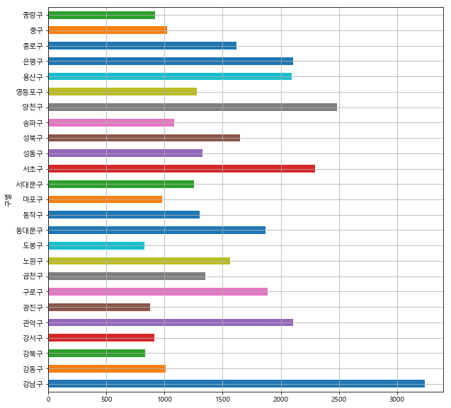
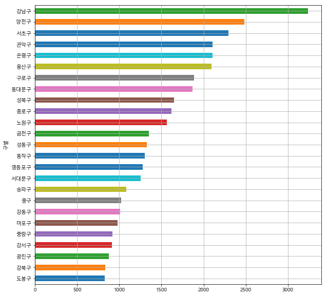
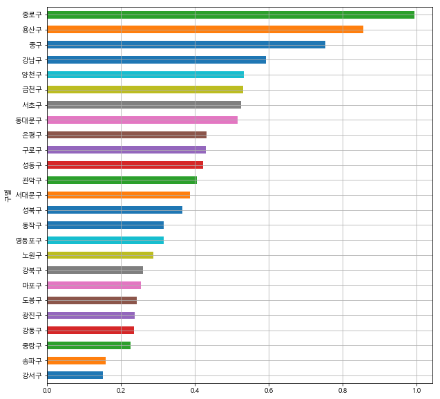
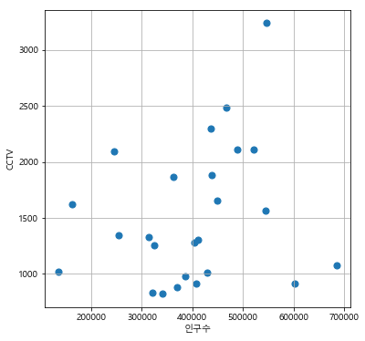
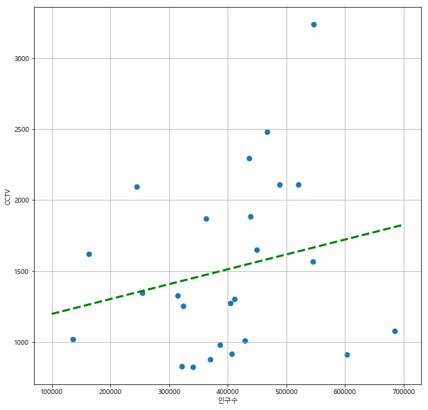
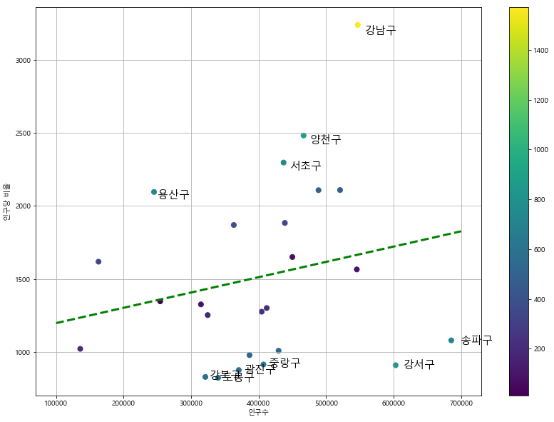

# 서울시 구별 CCTV 현황 분석


```python
import pandas as pd
import numpy as np
```

## 1-1. CSV 파일 읽기 - 서울시 CCTV 현황


```python
CCTV_Seoul = pd.read_csv('CCTV_in_Seoul.csv', encoding='utf-8')
CCTV_Seoul.head()
```


<div>
<style scoped>
    .dataframe tbody tr th:only-of-type {
        vertical-align: middle;
    }

    .dataframe tbody tr th {
        vertical-align: top;
    }

    .dataframe thead th {
        text-align: right;
    }
</style>
<table border="1" class="dataframe">
  <thead>
    <tr style="text-align: right;">
      <th></th>
      <th>기관명</th>
      <th>소계</th>
      <th>2013년도 이전</th>
      <th>2014년</th>
      <th>2015년</th>
      <th>2016년</th>
    </tr>
  </thead>
  <tbody>
    <tr>
      <th>0</th>
      <td>강남구</td>
      <td>3238</td>
      <td>1292</td>
      <td>430</td>
      <td>584</td>
      <td>932</td>
    </tr>
    <tr>
      <th>1</th>
      <td>강동구</td>
      <td>1010</td>
      <td>379</td>
      <td>99</td>
      <td>155</td>
      <td>377</td>
    </tr>
    <tr>
      <th>2</th>
      <td>강북구</td>
      <td>831</td>
      <td>369</td>
      <td>120</td>
      <td>138</td>
      <td>204</td>
    </tr>
    <tr>
      <th>3</th>
      <td>강서구</td>
      <td>911</td>
      <td>388</td>
      <td>258</td>
      <td>184</td>
      <td>81</td>
    </tr>
    <tr>
      <th>4</th>
      <td>관악구</td>
      <td>2109</td>
      <td>846</td>
      <td>260</td>
      <td>390</td>
      <td>613</td>
    </tr>
  </tbody>
</table>
</div>


```python
CCTV_Seoul.columns
```


    Index(['기관명', '소계', '2013년도 이전', '2014년', '2015년', '2016년'], dtype='object')


```python
CCTV_Seoul.columns[0]
```


    '기관명'


```python
CCTV_Seoul.rename(columns={CCTV_Seoul.columns[0] : '구별'}, # 컬럼 이름 변경
                  inplace=True) # 변수 내용 갱신
CCTV_Seoul.head()
```


<div>
<style scoped>
    .dataframe tbody tr th:only-of-type {
        vertical-align: middle;
    }

    .dataframe tbody tr th {
        vertical-align: top;
    }

    .dataframe thead th {
        text-align: right;
    }
</style>
<table border="1" class="dataframe">
  <thead>
    <tr style="text-align: right;">
      <th></th>
      <th>구별</th>
      <th>소계</th>
      <th>2013년도 이전</th>
      <th>2014년</th>
      <th>2015년</th>
      <th>2016년</th>
    </tr>
  </thead>
  <tbody>
    <tr>
      <th>0</th>
      <td>강남구</td>
      <td>3238</td>
      <td>1292</td>
      <td>430</td>
      <td>584</td>
      <td>932</td>
    </tr>
    <tr>
      <th>1</th>
      <td>강동구</td>
      <td>1010</td>
      <td>379</td>
      <td>99</td>
      <td>155</td>
      <td>377</td>
    </tr>
    <tr>
      <th>2</th>
      <td>강북구</td>
      <td>831</td>
      <td>369</td>
      <td>120</td>
      <td>138</td>
      <td>204</td>
    </tr>
    <tr>
      <th>3</th>
      <td>강서구</td>
      <td>911</td>
      <td>388</td>
      <td>258</td>
      <td>184</td>
      <td>81</td>
    </tr>
    <tr>
      <th>4</th>
      <td>관악구</td>
      <td>2109</td>
      <td>846</td>
      <td>260</td>
      <td>390</td>
      <td>613</td>
    </tr>
  </tbody>
</table>
</div>


## 1-2. Excel 파일 읽기 - 서울시 인구 현황


```python
pop_Seoul = pd.read_excel('population_in_Seoul.xls', encoding='utf-8')
pop_Seoul.head()
```


<div>
<style scoped>
    .dataframe tbody tr th:only-of-type {
        vertical-align: middle;
    }

    .dataframe tbody tr th {
        vertical-align: top;
    }

    .dataframe thead th {
        text-align: right;
    }
</style>
<table border="1" class="dataframe">
  <thead>
    <tr style="text-align: right;">
      <th></th>
      <th>기간</th>
      <th>자치구</th>
      <th>세대</th>
      <th>인구</th>
      <th>인구.1</th>
      <th>인구.2</th>
      <th>인구.3</th>
      <th>인구.4</th>
      <th>인구.5</th>
      <th>인구.6</th>
      <th>인구.7</th>
      <th>인구.8</th>
      <th>세대당인구</th>
      <th>65세이상고령자</th>
    </tr>
  </thead>
  <tbody>
    <tr>
      <th>0</th>
      <td>기간</td>
      <td>자치구</td>
      <td>세대</td>
      <td>합계</td>
      <td>합계</td>
      <td>합계</td>
      <td>한국인</td>
      <td>한국인</td>
      <td>한국인</td>
      <td>등록외국인</td>
      <td>등록외국인</td>
      <td>등록외국인</td>
      <td>세대당인구</td>
      <td>65세이상고령자</td>
    </tr>
    <tr>
      <th>1</th>
      <td>기간</td>
      <td>자치구</td>
      <td>세대</td>
      <td>계</td>
      <td>남자</td>
      <td>여자</td>
      <td>계</td>
      <td>남자</td>
      <td>여자</td>
      <td>계</td>
      <td>남자</td>
      <td>여자</td>
      <td>세대당인구</td>
      <td>65세이상고령자</td>
    </tr>
    <tr>
      <th>2</th>
      <td>2019.1/4</td>
      <td>합계</td>
      <td>4290922</td>
      <td>10054979</td>
      <td>4909387</td>
      <td>5145592</td>
      <td>9770216</td>
      <td>4772134</td>
      <td>4998082</td>
      <td>284763</td>
      <td>137253</td>
      <td>147510</td>
      <td>2.28</td>
      <td>1436125</td>
    </tr>
    <tr>
      <th>3</th>
      <td>2019.1/4</td>
      <td>종로구</td>
      <td>73914</td>
      <td>162913</td>
      <td>78963</td>
      <td>83950</td>
      <td>152778</td>
      <td>74536</td>
      <td>78242</td>
      <td>10135</td>
      <td>4427</td>
      <td>5708</td>
      <td>2.07</td>
      <td>26981</td>
    </tr>
    <tr>
      <th>4</th>
      <td>2019.1/4</td>
      <td>중구</td>
      <td>61800</td>
      <td>135836</td>
      <td>66720</td>
      <td>69116</td>
      <td>125942</td>
      <td>61992</td>
      <td>63950</td>
      <td>9894</td>
      <td>4728</td>
      <td>5166</td>
      <td>2.04</td>
      <td>22421</td>
    </tr>
  </tbody>
</table>
</div>


```python
pop_Seoul = pd.read_excel('population_in_Seoul.xls', header = 2, usecols = 'B, D, G, J, N', encoding='utf-8')
pop_Seoul.head()
```


<div>
<style scoped>
    .dataframe tbody tr th:only-of-type {
        vertical-align: middle;
    }

    .dataframe tbody tr th {
        vertical-align: top;
    }

    .dataframe thead th {
        text-align: right;
    }
</style>
<table border="1" class="dataframe">
  <thead>
    <tr style="text-align: right;">
      <th></th>
      <th>자치구</th>
      <th>계</th>
      <th>계.1</th>
      <th>계.2</th>
      <th>65세이상고령자</th>
    </tr>
  </thead>
  <tbody>
    <tr>
      <th>0</th>
      <td>합계</td>
      <td>10054979</td>
      <td>9770216</td>
      <td>284763</td>
      <td>1436125</td>
    </tr>
    <tr>
      <th>1</th>
      <td>종로구</td>
      <td>162913</td>
      <td>152778</td>
      <td>10135</td>
      <td>26981</td>
    </tr>
    <tr>
      <th>2</th>
      <td>중구</td>
      <td>135836</td>
      <td>125942</td>
      <td>9894</td>
      <td>22421</td>
    </tr>
    <tr>
      <th>3</th>
      <td>용산구</td>
      <td>245139</td>
      <td>229168</td>
      <td>15971</td>
      <td>38049</td>
    </tr>
    <tr>
      <th>4</th>
      <td>성동구</td>
      <td>314608</td>
      <td>306404</td>
      <td>8204</td>
      <td>43076</td>
    </tr>
  </tbody>
</table>
</div>


```python
pop_Seoul.rename(columns = {pop_Seoul.columns[0] : '구별',
                            pop_Seoul.columns[1] : '인구수',
                            pop_Seoul.columns[2] : '한국인',
                            pop_Seoul.columns[3] : '외국인',
                            pop_Seoul.columns[4] : '고령자'}, inplace=True)
pop_Seoul.head()
```


<div>
<style scoped>
    .dataframe tbody tr th:only-of-type {
        vertical-align: middle;
    }

    .dataframe tbody tr th {
        vertical-align: top;
    }

    .dataframe thead th {
        text-align: right;
    }
</style>
<table border="1" class="dataframe">
  <thead>
    <tr style="text-align: right;">
      <th></th>
      <th>구별</th>
      <th>인구수</th>
      <th>한국인</th>
      <th>외국인</th>
      <th>고령자</th>
    </tr>
  </thead>
  <tbody>
    <tr>
      <th>0</th>
      <td>합계</td>
      <td>10054979</td>
      <td>9770216</td>
      <td>284763</td>
      <td>1436125</td>
    </tr>
    <tr>
      <th>1</th>
      <td>종로구</td>
      <td>162913</td>
      <td>152778</td>
      <td>10135</td>
      <td>26981</td>
    </tr>
    <tr>
      <th>2</th>
      <td>중구</td>
      <td>135836</td>
      <td>125942</td>
      <td>9894</td>
      <td>22421</td>
    </tr>
    <tr>
      <th>3</th>
      <td>용산구</td>
      <td>245139</td>
      <td>229168</td>
      <td>15971</td>
      <td>38049</td>
    </tr>
    <tr>
      <th>4</th>
      <td>성동구</td>
      <td>314608</td>
      <td>306404</td>
      <td>8204</td>
      <td>43076</td>
    </tr>
  </tbody>
</table>
</div>


## 2-1. CCTV 데이터 파악


```python
CCTV_Seoul.head()
```


<div>
<style scoped>
    .dataframe tbody tr th:only-of-type {
        vertical-align: middle;
    }

    .dataframe tbody tr th {
        vertical-align: top;
    }

    .dataframe thead th {
        text-align: right;
    }
</style>
<table border="1" class="dataframe">
  <thead>
    <tr style="text-align: right;">
      <th></th>
      <th>구별</th>
      <th>소계</th>
      <th>2013년도 이전</th>
      <th>2014년</th>
      <th>2015년</th>
      <th>2016년</th>
    </tr>
  </thead>
  <tbody>
    <tr>
      <th>0</th>
      <td>강남구</td>
      <td>3238</td>
      <td>1292</td>
      <td>430</td>
      <td>584</td>
      <td>932</td>
    </tr>
    <tr>
      <th>1</th>
      <td>강동구</td>
      <td>1010</td>
      <td>379</td>
      <td>99</td>
      <td>155</td>
      <td>377</td>
    </tr>
    <tr>
      <th>2</th>
      <td>강북구</td>
      <td>831</td>
      <td>369</td>
      <td>120</td>
      <td>138</td>
      <td>204</td>
    </tr>
    <tr>
      <th>3</th>
      <td>강서구</td>
      <td>911</td>
      <td>388</td>
      <td>258</td>
      <td>184</td>
      <td>81</td>
    </tr>
    <tr>
      <th>4</th>
      <td>관악구</td>
      <td>2109</td>
      <td>846</td>
      <td>260</td>
      <td>390</td>
      <td>613</td>
    </tr>
  </tbody>
</table>
</div>


```python
CCTV_Seoul.sort_values(by='소계', ascending=True).head(5)
```


<div>
<style scoped>
    .dataframe tbody tr th:only-of-type {
        vertical-align: middle;
    }

    .dataframe tbody tr th {
        vertical-align: top;
    }

    .dataframe thead th {
        text-align: right;
    }
</style>
<table border="1" class="dataframe">
  <thead>
    <tr style="text-align: right;">
      <th></th>
      <th>구별</th>
      <th>소계</th>
      <th>2013년도 이전</th>
      <th>2014년</th>
      <th>2015년</th>
      <th>2016년</th>
    </tr>
  </thead>
  <tbody>
    <tr>
      <th>9</th>
      <td>도봉구</td>
      <td>825</td>
      <td>238</td>
      <td>159</td>
      <td>42</td>
      <td>386</td>
    </tr>
    <tr>
      <th>2</th>
      <td>강북구</td>
      <td>831</td>
      <td>369</td>
      <td>120</td>
      <td>138</td>
      <td>204</td>
    </tr>
    <tr>
      <th>5</th>
      <td>광진구</td>
      <td>878</td>
      <td>573</td>
      <td>78</td>
      <td>53</td>
      <td>174</td>
    </tr>
    <tr>
      <th>3</th>
      <td>강서구</td>
      <td>911</td>
      <td>388</td>
      <td>258</td>
      <td>184</td>
      <td>81</td>
    </tr>
    <tr>
      <th>24</th>
      <td>중랑구</td>
      <td>916</td>
      <td>509</td>
      <td>121</td>
      <td>177</td>
      <td>109</td>
    </tr>
  </tbody>
</table>
</div>


```python
CCTV_Seoul.sort_values(by='소계', ascending=False).head(5)
```


<div>
<style scoped>
    .dataframe tbody tr th:only-of-type {
        vertical-align: middle;
    }

    .dataframe tbody tr th {
        vertical-align: top;
    }

    .dataframe thead th {
        text-align: right;
    }
</style>
<table border="1" class="dataframe">
  <thead>
    <tr style="text-align: right;">
      <th></th>
      <th>구별</th>
      <th>소계</th>
      <th>2013년도 이전</th>
      <th>2014년</th>
      <th>2015년</th>
      <th>2016년</th>
    </tr>
  </thead>
  <tbody>
    <tr>
      <th>0</th>
      <td>강남구</td>
      <td>3238</td>
      <td>1292</td>
      <td>430</td>
      <td>584</td>
      <td>932</td>
    </tr>
    <tr>
      <th>18</th>
      <td>양천구</td>
      <td>2482</td>
      <td>1843</td>
      <td>142</td>
      <td>30</td>
      <td>467</td>
    </tr>
    <tr>
      <th>14</th>
      <td>서초구</td>
      <td>2297</td>
      <td>1406</td>
      <td>157</td>
      <td>336</td>
      <td>398</td>
    </tr>
    <tr>
      <th>4</th>
      <td>관악구</td>
      <td>2109</td>
      <td>846</td>
      <td>260</td>
      <td>390</td>
      <td>613</td>
    </tr>
    <tr>
      <th>21</th>
      <td>은평구</td>
      <td>2108</td>
      <td>1138</td>
      <td>224</td>
      <td>278</td>
      <td>468</td>
    </tr>
  </tbody>
</table>
</div>


### * 최근 3년간 CCTV 증가율 계산


```python
CCTV_Seoul['최근 증가율'] = (CCTV_Seoul['2014년'] + CCTV_Seoul['2015년'] + CCTV_Seoul['2016년']) / CCTV_Seoul['2013년도 이전'] * 100
CCTV_Seoul.sort_values(by='최근 증가율', ascending=False).head(5)
```


<div>
<style scoped>
    .dataframe tbody tr th:only-of-type {
        vertical-align: middle;
    }

    .dataframe tbody tr th {
        vertical-align: top;
    }

    .dataframe thead th {
        text-align: right;
    }
</style>
<table border="1" class="dataframe">
  <thead>
    <tr style="text-align: right;">
      <th></th>
      <th>구별</th>
      <th>소계</th>
      <th>2013년도 이전</th>
      <th>2014년</th>
      <th>2015년</th>
      <th>2016년</th>
      <th>최근 증가율</th>
    </tr>
  </thead>
  <tbody>
    <tr>
      <th>22</th>
      <td>종로구</td>
      <td>1619</td>
      <td>464</td>
      <td>314</td>
      <td>211</td>
      <td>630</td>
      <td>248.922414</td>
    </tr>
    <tr>
      <th>9</th>
      <td>도봉구</td>
      <td>825</td>
      <td>238</td>
      <td>159</td>
      <td>42</td>
      <td>386</td>
      <td>246.638655</td>
    </tr>
    <tr>
      <th>12</th>
      <td>마포구</td>
      <td>980</td>
      <td>314</td>
      <td>118</td>
      <td>169</td>
      <td>379</td>
      <td>212.101911</td>
    </tr>
    <tr>
      <th>8</th>
      <td>노원구</td>
      <td>1566</td>
      <td>542</td>
      <td>57</td>
      <td>451</td>
      <td>516</td>
      <td>188.929889</td>
    </tr>
    <tr>
      <th>1</th>
      <td>강동구</td>
      <td>1010</td>
      <td>379</td>
      <td>99</td>
      <td>155</td>
      <td>377</td>
      <td>166.490765</td>
    </tr>
  </tbody>
</table>
</div>


## 2-2. 인구 데이터 파악


```python
pop_Seoul.head()
```


<div>
<style scoped>
    .dataframe tbody tr th:only-of-type {
        vertical-align: middle;
    }

    .dataframe tbody tr th {
        vertical-align: top;
    }

    .dataframe thead th {
        text-align: right;
    }
</style>
<table border="1" class="dataframe">
  <thead>
    <tr style="text-align: right;">
      <th></th>
      <th>구별</th>
      <th>인구수</th>
      <th>한국인</th>
      <th>외국인</th>
      <th>고령자</th>
    </tr>
  </thead>
  <tbody>
    <tr>
      <th>0</th>
      <td>합계</td>
      <td>10054979</td>
      <td>9770216</td>
      <td>284763</td>
      <td>1436125</td>
    </tr>
    <tr>
      <th>1</th>
      <td>종로구</td>
      <td>162913</td>
      <td>152778</td>
      <td>10135</td>
      <td>26981</td>
    </tr>
    <tr>
      <th>2</th>
      <td>중구</td>
      <td>135836</td>
      <td>125942</td>
      <td>9894</td>
      <td>22421</td>
    </tr>
    <tr>
      <th>3</th>
      <td>용산구</td>
      <td>245139</td>
      <td>229168</td>
      <td>15971</td>
      <td>38049</td>
    </tr>
    <tr>
      <th>4</th>
      <td>성동구</td>
      <td>314608</td>
      <td>306404</td>
      <td>8204</td>
      <td>43076</td>
    </tr>
  </tbody>
</table>
</div>


```python
pop_Seoul.drop([0], inplace=True)
pop_Seoul.head()
```


<div>
<style scoped>
    .dataframe tbody tr th:only-of-type {
        vertical-align: middle;
    }

    .dataframe tbody tr th {
        vertical-align: top;
    }

    .dataframe thead th {
        text-align: right;
    }
</style>
<table border="1" class="dataframe">
  <thead>
    <tr style="text-align: right;">
      <th></th>
      <th>구별</th>
      <th>인구수</th>
      <th>한국인</th>
      <th>외국인</th>
      <th>고령자</th>
    </tr>
  </thead>
  <tbody>
    <tr>
      <th>1</th>
      <td>종로구</td>
      <td>162913</td>
      <td>152778</td>
      <td>10135</td>
      <td>26981</td>
    </tr>
    <tr>
      <th>2</th>
      <td>중구</td>
      <td>135836</td>
      <td>125942</td>
      <td>9894</td>
      <td>22421</td>
    </tr>
    <tr>
      <th>3</th>
      <td>용산구</td>
      <td>245139</td>
      <td>229168</td>
      <td>15971</td>
      <td>38049</td>
    </tr>
    <tr>
      <th>4</th>
      <td>성동구</td>
      <td>314608</td>
      <td>306404</td>
      <td>8204</td>
      <td>43076</td>
    </tr>
    <tr>
      <th>5</th>
      <td>광진구</td>
      <td>370658</td>
      <td>354873</td>
      <td>15785</td>
      <td>46288</td>
    </tr>
  </tbody>
</table>
</div>


```python
pop_Seoul['구별'].unique() # 반복된 데이터는 하나로 나타냄
```


    array(['종로구', '중구', '용산구', '성동구', '광진구', '동대문구', '중랑구', '성북구', '강북구',
           '도봉구', '노원구', '은평구', '서대문구', '마포구', '양천구', '강서구', '구로구', '금천구',
           '영등포구', '동작구', '관악구', '서초구', '강남구', '송파구', '강동구'], dtype=object)


```python
pop_Seoul[pop_Seoul['구별'].isnull()] # NaN 데이터 추출
```


<div>
<style scoped>
    .dataframe tbody tr th:only-of-type {
        vertical-align: middle;
    }

    .dataframe tbody tr th {
        vertical-align: top;
    }

    .dataframe thead th {
        text-align: right;
    }
</style>
<table border="1" class="dataframe">
  <thead>
    <tr style="text-align: right;">
      <th></th>
      <th>구별</th>
      <th>인구수</th>
      <th>한국인</th>
      <th>외국인</th>
      <th>고령자</th>
    </tr>
  </thead>
  <tbody>
  </tbody>
</table>
</div>


### * 구별 '외국인 비율' & '고령자 비율' 계산


```python
pop_Seoul['외국인 비율'] = pop_Seoul['외국인'] / pop_Seoul['인구수'] * 100
pop_Seoul['고령자 비율'] = pop_Seoul['고령자'] / pop_Seoul['인구수'] * 100
pop_Seoul.head()
```


<div>
<style scoped>
    .dataframe tbody tr th:only-of-type {
        vertical-align: middle;
    }

    .dataframe tbody tr th {
        vertical-align: top;
    }

    .dataframe thead th {
        text-align: right;
    }
</style>
<table border="1" class="dataframe">
  <thead>
    <tr style="text-align: right;">
      <th></th>
      <th>구별</th>
      <th>인구수</th>
      <th>한국인</th>
      <th>외국인</th>
      <th>고령자</th>
      <th>외국인 비율</th>
      <th>고령자 비율</th>
    </tr>
  </thead>
  <tbody>
    <tr>
      <th>1</th>
      <td>종로구</td>
      <td>162913</td>
      <td>152778</td>
      <td>10135</td>
      <td>26981</td>
      <td>6.221112</td>
      <td>16.561600</td>
    </tr>
    <tr>
      <th>2</th>
      <td>중구</td>
      <td>135836</td>
      <td>125942</td>
      <td>9894</td>
      <td>22421</td>
      <td>7.283783</td>
      <td>16.505934</td>
    </tr>
    <tr>
      <th>3</th>
      <td>용산구</td>
      <td>245139</td>
      <td>229168</td>
      <td>15971</td>
      <td>38049</td>
      <td>6.515079</td>
      <td>15.521398</td>
    </tr>
    <tr>
      <th>4</th>
      <td>성동구</td>
      <td>314608</td>
      <td>306404</td>
      <td>8204</td>
      <td>43076</td>
      <td>2.607690</td>
      <td>13.691960</td>
    </tr>
    <tr>
      <th>5</th>
      <td>광진구</td>
      <td>370658</td>
      <td>354873</td>
      <td>15785</td>
      <td>46288</td>
      <td>4.258643</td>
      <td>12.488062</td>
    </tr>
  </tbody>
</table>
</div>


```python
pop_Seoul.sort_values(by='인구수', ascending=False).head(5)
```


<div>
<style scoped>
    .dataframe tbody tr th:only-of-type {
        vertical-align: middle;
    }

    .dataframe tbody tr th {
        vertical-align: top;
    }

    .dataframe thead th {
        text-align: right;
    }
</style>
<table border="1" class="dataframe">
  <thead>
    <tr style="text-align: right;">
      <th></th>
      <th>구별</th>
      <th>인구수</th>
      <th>한국인</th>
      <th>외국인</th>
      <th>고령자</th>
      <th>외국인 비율</th>
      <th>고령자 비율</th>
    </tr>
  </thead>
  <tbody>
    <tr>
      <th>24</th>
      <td>송파구</td>
      <td>685361</td>
      <td>678521</td>
      <td>6840</td>
      <td>83492</td>
      <td>0.998014</td>
      <td>12.182193</td>
    </tr>
    <tr>
      <th>16</th>
      <td>강서구</td>
      <td>602886</td>
      <td>596287</td>
      <td>6599</td>
      <td>80903</td>
      <td>1.094568</td>
      <td>13.419287</td>
    </tr>
    <tr>
      <th>23</th>
      <td>강남구</td>
      <td>546875</td>
      <td>541854</td>
      <td>5021</td>
      <td>68104</td>
      <td>0.918126</td>
      <td>12.453303</td>
    </tr>
    <tr>
      <th>11</th>
      <td>노원구</td>
      <td>545486</td>
      <td>541174</td>
      <td>4312</td>
      <td>78170</td>
      <td>0.790488</td>
      <td>14.330340</td>
    </tr>
    <tr>
      <th>21</th>
      <td>관악구</td>
      <td>520645</td>
      <td>502615</td>
      <td>18030</td>
      <td>73005</td>
      <td>3.463012</td>
      <td>14.022030</td>
    </tr>
  </tbody>
</table>
</div>


```python
pop_Seoul.sort_values(by='외국인', ascending=False).head(5)
```


<div>
<style scoped>
    .dataframe tbody tr th:only-of-type {
        vertical-align: middle;
    }

    .dataframe tbody tr th {
        vertical-align: top;
    }

    .dataframe thead th {
        text-align: right;
    }
</style>
<table border="1" class="dataframe">
  <thead>
    <tr style="text-align: right;">
      <th></th>
      <th>구별</th>
      <th>인구수</th>
      <th>한국인</th>
      <th>외국인</th>
      <th>고령자</th>
      <th>외국인 비율</th>
      <th>고령자 비율</th>
    </tr>
  </thead>
  <tbody>
    <tr>
      <th>19</th>
      <td>영등포구</td>
      <td>404556</td>
      <td>368824</td>
      <td>35732</td>
      <td>56463</td>
      <td>8.832399</td>
      <td>13.956782</td>
    </tr>
    <tr>
      <th>17</th>
      <td>구로구</td>
      <td>438889</td>
      <td>404726</td>
      <td>34163</td>
      <td>63017</td>
      <td>7.783973</td>
      <td>14.358300</td>
    </tr>
    <tr>
      <th>18</th>
      <td>금천구</td>
      <td>254244</td>
      <td>233981</td>
      <td>20263</td>
      <td>36301</td>
      <td>7.969903</td>
      <td>14.278016</td>
    </tr>
    <tr>
      <th>21</th>
      <td>관악구</td>
      <td>520645</td>
      <td>502615</td>
      <td>18030</td>
      <td>73005</td>
      <td>3.463012</td>
      <td>14.022030</td>
    </tr>
    <tr>
      <th>6</th>
      <td>동대문구</td>
      <td>363262</td>
      <td>346750</td>
      <td>16512</td>
      <td>57570</td>
      <td>4.545480</td>
      <td>15.848066</td>
    </tr>
  </tbody>
</table>
</div>


```python
pop_Seoul.sort_values(by='외국인 비율', ascending=False).head(5)
```


<div>
<style scoped>
    .dataframe tbody tr th:only-of-type {
        vertical-align: middle;
    }

    .dataframe tbody tr th {
        vertical-align: top;
    }

    .dataframe thead th {
        text-align: right;
    }
</style>
<table border="1" class="dataframe">
  <thead>
    <tr style="text-align: right;">
      <th></th>
      <th>구별</th>
      <th>인구수</th>
      <th>한국인</th>
      <th>외국인</th>
      <th>고령자</th>
      <th>외국인 비율</th>
      <th>고령자 비율</th>
    </tr>
  </thead>
  <tbody>
    <tr>
      <th>19</th>
      <td>영등포구</td>
      <td>404556</td>
      <td>368824</td>
      <td>35732</td>
      <td>56463</td>
      <td>8.832399</td>
      <td>13.956782</td>
    </tr>
    <tr>
      <th>18</th>
      <td>금천구</td>
      <td>254244</td>
      <td>233981</td>
      <td>20263</td>
      <td>36301</td>
      <td>7.969903</td>
      <td>14.278016</td>
    </tr>
    <tr>
      <th>17</th>
      <td>구로구</td>
      <td>438889</td>
      <td>404726</td>
      <td>34163</td>
      <td>63017</td>
      <td>7.783973</td>
      <td>14.358300</td>
    </tr>
    <tr>
      <th>2</th>
      <td>중구</td>
      <td>135836</td>
      <td>125942</td>
      <td>9894</td>
      <td>22421</td>
      <td>7.283783</td>
      <td>16.505934</td>
    </tr>
    <tr>
      <th>3</th>
      <td>용산구</td>
      <td>245139</td>
      <td>229168</td>
      <td>15971</td>
      <td>38049</td>
      <td>6.515079</td>
      <td>15.521398</td>
    </tr>
  </tbody>
</table>
</div>


```python
pop_Seoul.sort_values(by='고령자', ascending=False).head(5)
```


<div>
<style scoped>
    .dataframe tbody tr th:only-of-type {
        vertical-align: middle;
    }

    .dataframe tbody tr th {
        vertical-align: top;
    }

    .dataframe thead th {
        text-align: right;
    }
</style>
<table border="1" class="dataframe">
  <thead>
    <tr style="text-align: right;">
      <th></th>
      <th>구별</th>
      <th>인구수</th>
      <th>한국인</th>
      <th>외국인</th>
      <th>고령자</th>
      <th>외국인 비율</th>
      <th>고령자 비율</th>
    </tr>
  </thead>
  <tbody>
    <tr>
      <th>24</th>
      <td>송파구</td>
      <td>685361</td>
      <td>678521</td>
      <td>6840</td>
      <td>83492</td>
      <td>0.998014</td>
      <td>12.182193</td>
    </tr>
    <tr>
      <th>16</th>
      <td>강서구</td>
      <td>602886</td>
      <td>596287</td>
      <td>6599</td>
      <td>80903</td>
      <td>1.094568</td>
      <td>13.419287</td>
    </tr>
    <tr>
      <th>12</th>
      <td>은평구</td>
      <td>488713</td>
      <td>484274</td>
      <td>4439</td>
      <td>78406</td>
      <td>0.908304</td>
      <td>16.043363</td>
    </tr>
    <tr>
      <th>11</th>
      <td>노원구</td>
      <td>545486</td>
      <td>541174</td>
      <td>4312</td>
      <td>78170</td>
      <td>0.790488</td>
      <td>14.330340</td>
    </tr>
    <tr>
      <th>21</th>
      <td>관악구</td>
      <td>520645</td>
      <td>502615</td>
      <td>18030</td>
      <td>73005</td>
      <td>3.463012</td>
      <td>14.022030</td>
    </tr>
  </tbody>
</table>
</div>


```python
pop_Seoul.sort_values(by='고령자 비율', ascending=False).head(5)
```


<div>
<style scoped>
    .dataframe tbody tr th:only-of-type {
        vertical-align: middle;
    }

    .dataframe tbody tr th {
        vertical-align: top;
    }

    .dataframe thead th {
        text-align: right;
    }
</style>
<table border="1" class="dataframe">
  <thead>
    <tr style="text-align: right;">
      <th></th>
      <th>구별</th>
      <th>인구수</th>
      <th>한국인</th>
      <th>외국인</th>
      <th>고령자</th>
      <th>외국인 비율</th>
      <th>고령자 비율</th>
    </tr>
  </thead>
  <tbody>
    <tr>
      <th>9</th>
      <td>강북구</td>
      <td>321151</td>
      <td>317386</td>
      <td>3765</td>
      <td>58858</td>
      <td>1.172346</td>
      <td>18.327204</td>
    </tr>
    <tr>
      <th>10</th>
      <td>도봉구</td>
      <td>340089</td>
      <td>337820</td>
      <td>2269</td>
      <td>56742</td>
      <td>0.667178</td>
      <td>16.684456</td>
    </tr>
    <tr>
      <th>1</th>
      <td>종로구</td>
      <td>162913</td>
      <td>152778</td>
      <td>10135</td>
      <td>26981</td>
      <td>6.221112</td>
      <td>16.561600</td>
    </tr>
    <tr>
      <th>2</th>
      <td>중구</td>
      <td>135836</td>
      <td>125942</td>
      <td>9894</td>
      <td>22421</td>
      <td>7.283783</td>
      <td>16.505934</td>
    </tr>
    <tr>
      <th>12</th>
      <td>은평구</td>
      <td>488713</td>
      <td>484274</td>
      <td>4439</td>
      <td>78406</td>
      <td>0.908304</td>
      <td>16.043363</td>
    </tr>
  </tbody>
</table>
</div>


## 3. CCTV 데이터와 인구 현황 데이터를 합치고 분석
* drop: 행 방향 삭제
* del: 열 방향 삭제


```python
data_result = pd.merge(CCTV_Seoul, pop_Seoul, on='구별')
data_result.head()
```


<div>
<style scoped>
    .dataframe tbody tr th:only-of-type {
        vertical-align: middle;
    }

    .dataframe tbody tr th {
        vertical-align: top;
    }

    .dataframe thead th {
        text-align: right;
    }
</style>
<table border="1" class="dataframe">
  <thead>
    <tr style="text-align: right;">
      <th></th>
      <th>구별</th>
      <th>소계</th>
      <th>2013년도 이전</th>
      <th>2014년</th>
      <th>2015년</th>
      <th>2016년</th>
      <th>최근 증가율</th>
      <th>인구수</th>
      <th>한국인</th>
      <th>외국인</th>
      <th>고령자</th>
      <th>외국인 비율</th>
      <th>고령자 비율</th>
    </tr>
  </thead>
  <tbody>
    <tr>
      <th>0</th>
      <td>강남구</td>
      <td>3238</td>
      <td>1292</td>
      <td>430</td>
      <td>584</td>
      <td>932</td>
      <td>150.619195</td>
      <td>546875</td>
      <td>541854</td>
      <td>5021</td>
      <td>68104</td>
      <td>0.918126</td>
      <td>12.453303</td>
    </tr>
    <tr>
      <th>1</th>
      <td>강동구</td>
      <td>1010</td>
      <td>379</td>
      <td>99</td>
      <td>155</td>
      <td>377</td>
      <td>166.490765</td>
      <td>429601</td>
      <td>425267</td>
      <td>4334</td>
      <td>59742</td>
      <td>1.008843</td>
      <td>13.906392</td>
    </tr>
    <tr>
      <th>2</th>
      <td>강북구</td>
      <td>831</td>
      <td>369</td>
      <td>120</td>
      <td>138</td>
      <td>204</td>
      <td>125.203252</td>
      <td>321151</td>
      <td>317386</td>
      <td>3765</td>
      <td>58858</td>
      <td>1.172346</td>
      <td>18.327204</td>
    </tr>
    <tr>
      <th>3</th>
      <td>강서구</td>
      <td>911</td>
      <td>388</td>
      <td>258</td>
      <td>184</td>
      <td>81</td>
      <td>134.793814</td>
      <td>602886</td>
      <td>596287</td>
      <td>6599</td>
      <td>80903</td>
      <td>1.094568</td>
      <td>13.419287</td>
    </tr>
    <tr>
      <th>4</th>
      <td>관악구</td>
      <td>2109</td>
      <td>846</td>
      <td>260</td>
      <td>390</td>
      <td>613</td>
      <td>149.290780</td>
      <td>520645</td>
      <td>502615</td>
      <td>18030</td>
      <td>73005</td>
      <td>3.463012</td>
      <td>14.022030</td>
    </tr>
  </tbody>
</table>
</div>


```python
del data_result['2013년도 이전']
del data_result['2014년']
del data_result['2015년']
del data_result['2016년']
data_result.head()
```


<div>
<style scoped>
    .dataframe tbody tr th:only-of-type {
        vertical-align: middle;
    }

    .dataframe tbody tr th {
        vertical-align: top;
    }

    .dataframe thead th {
        text-align: right;
    }
</style>
<table border="1" class="dataframe">
  <thead>
    <tr style="text-align: right;">
      <th></th>
      <th>구별</th>
      <th>소계</th>
      <th>최근 증가율</th>
      <th>인구수</th>
      <th>한국인</th>
      <th>외국인</th>
      <th>고령자</th>
      <th>외국인 비율</th>
      <th>고령자 비율</th>
    </tr>
  </thead>
  <tbody>
    <tr>
      <th>0</th>
      <td>강남구</td>
      <td>3238</td>
      <td>150.619195</td>
      <td>546875</td>
      <td>541854</td>
      <td>5021</td>
      <td>68104</td>
      <td>0.918126</td>
      <td>12.453303</td>
    </tr>
    <tr>
      <th>1</th>
      <td>강동구</td>
      <td>1010</td>
      <td>166.490765</td>
      <td>429601</td>
      <td>425267</td>
      <td>4334</td>
      <td>59742</td>
      <td>1.008843</td>
      <td>13.906392</td>
    </tr>
    <tr>
      <th>2</th>
      <td>강북구</td>
      <td>831</td>
      <td>125.203252</td>
      <td>321151</td>
      <td>317386</td>
      <td>3765</td>
      <td>58858</td>
      <td>1.172346</td>
      <td>18.327204</td>
    </tr>
    <tr>
      <th>3</th>
      <td>강서구</td>
      <td>911</td>
      <td>134.793814</td>
      <td>602886</td>
      <td>596287</td>
      <td>6599</td>
      <td>80903</td>
      <td>1.094568</td>
      <td>13.419287</td>
    </tr>
    <tr>
      <th>4</th>
      <td>관악구</td>
      <td>2109</td>
      <td>149.290780</td>
      <td>520645</td>
      <td>502615</td>
      <td>18030</td>
      <td>73005</td>
      <td>3.463012</td>
      <td>14.022030</td>
    </tr>
  </tbody>
</table>
</div>


```python
data_result.set_index('구별', inplace=True) # index 설정
data_result.head()
```


<div>
<style scoped>
    .dataframe tbody tr th:only-of-type {
        vertical-align: middle;
    }

    .dataframe tbody tr th {
        vertical-align: top;
    }

    .dataframe thead th {
        text-align: right;
    }
</style>
<table border="1" class="dataframe">
  <thead>
    <tr style="text-align: right;">
      <th></th>
      <th>소계</th>
      <th>최근 증가율</th>
      <th>인구수</th>
      <th>한국인</th>
      <th>외국인</th>
      <th>고령자</th>
      <th>외국인 비율</th>
      <th>고령자 비율</th>
    </tr>
    <tr>
      <th>구별</th>
      <th></th>
      <th></th>
      <th></th>
      <th></th>
      <th></th>
      <th></th>
      <th></th>
      <th></th>
    </tr>
  </thead>
  <tbody>
    <tr>
      <th>강남구</th>
      <td>3238</td>
      <td>150.619195</td>
      <td>546875</td>
      <td>541854</td>
      <td>5021</td>
      <td>68104</td>
      <td>0.918126</td>
      <td>12.453303</td>
    </tr>
    <tr>
      <th>강동구</th>
      <td>1010</td>
      <td>166.490765</td>
      <td>429601</td>
      <td>425267</td>
      <td>4334</td>
      <td>59742</td>
      <td>1.008843</td>
      <td>13.906392</td>
    </tr>
    <tr>
      <th>강북구</th>
      <td>831</td>
      <td>125.203252</td>
      <td>321151</td>
      <td>317386</td>
      <td>3765</td>
      <td>58858</td>
      <td>1.172346</td>
      <td>18.327204</td>
    </tr>
    <tr>
      <th>강서구</th>
      <td>911</td>
      <td>134.793814</td>
      <td>602886</td>
      <td>596287</td>
      <td>6599</td>
      <td>80903</td>
      <td>1.094568</td>
      <td>13.419287</td>
    </tr>
    <tr>
      <th>관악구</th>
      <td>2109</td>
      <td>149.290780</td>
      <td>520645</td>
      <td>502615</td>
      <td>18030</td>
      <td>73005</td>
      <td>3.463012</td>
      <td>14.022030</td>
    </tr>
  </tbody>
</table>
</div>


### * 상관계수 조사
* 상관계수의 <u>절대값이 클수록</u> 두 데이터는 <u>관계가 있다</u>고 볼 수 있음
* 0.1 이하면 거의 무시, 0.3 이하면 약한 상관관계, 0.7 이하면 뚜렷한 상관관계


```python
np.corrcoef(data_result['고령자 비율'], data_result['소계']) # 약한 음의 상관관계
```


    array([[ 1.        , -0.28134716],
           [-0.28134716,  1.        ]])


```python
np.corrcoef(data_result['외국인 비율'], data_result['소계']) # 뚜렷한 음의 상관관계 (한 쪽이 증가하면 다른 쪽은 감소)
```


    array([[ 1.        , -0.05210682],
           [-0.05210682,  1.        ]])


```python
np.corrcoef(data_result['인구수'], data_result['소계']) # 약한 양의 상관관계
```


    array([[1.        , 0.21773943],
           [0.21773943, 1.        ]])


```python
data_result.sort_values(by='소계', ascending=False).head(5)
```


<div>
<style scoped>
    .dataframe tbody tr th:only-of-type {
        vertical-align: middle;
    }

    .dataframe tbody tr th {
        vertical-align: top;
    }

    .dataframe thead th {
        text-align: right;
    }
</style>
<table border="1" class="dataframe">
  <thead>
    <tr style="text-align: right;">
      <th></th>
      <th>소계</th>
      <th>최근 증가율</th>
      <th>인구수</th>
      <th>한국인</th>
      <th>외국인</th>
      <th>고령자</th>
      <th>외국인 비율</th>
      <th>고령자 비율</th>
    </tr>
    <tr>
      <th>구별</th>
      <th></th>
      <th></th>
      <th></th>
      <th></th>
      <th></th>
      <th></th>
      <th></th>
      <th></th>
    </tr>
  </thead>
  <tbody>
    <tr>
      <th>강남구</th>
      <td>3238</td>
      <td>150.619195</td>
      <td>546875</td>
      <td>541854</td>
      <td>5021</td>
      <td>68104</td>
      <td>0.918126</td>
      <td>12.453303</td>
    </tr>
    <tr>
      <th>양천구</th>
      <td>2482</td>
      <td>34.671731</td>
      <td>466622</td>
      <td>462599</td>
      <td>4023</td>
      <td>58930</td>
      <td>0.862154</td>
      <td>12.629066</td>
    </tr>
    <tr>
      <th>서초구</th>
      <td>2297</td>
      <td>63.371266</td>
      <td>437007</td>
      <td>432762</td>
      <td>4245</td>
      <td>55366</td>
      <td>0.971380</td>
      <td>12.669362</td>
    </tr>
    <tr>
      <th>관악구</th>
      <td>2109</td>
      <td>149.290780</td>
      <td>520645</td>
      <td>502615</td>
      <td>18030</td>
      <td>73005</td>
      <td>3.463012</td>
      <td>14.022030</td>
    </tr>
    <tr>
      <th>은평구</th>
      <td>2108</td>
      <td>85.237258</td>
      <td>488713</td>
      <td>484274</td>
      <td>4439</td>
      <td>78406</td>
      <td>0.908304</td>
      <td>16.043363</td>
    </tr>
  </tbody>
</table>
</div>


```python
data_result.sort_values(by='인구수', ascending=False).head(5)
```


<div>
<style scoped>
    .dataframe tbody tr th:only-of-type {
        vertical-align: middle;
    }

    .dataframe tbody tr th {
        vertical-align: top;
    }

    .dataframe thead th {
        text-align: right;
    }
</style>
<table border="1" class="dataframe">
  <thead>
    <tr style="text-align: right;">
      <th></th>
      <th>소계</th>
      <th>최근 증가율</th>
      <th>인구수</th>
      <th>한국인</th>
      <th>외국인</th>
      <th>고령자</th>
      <th>외국인 비율</th>
      <th>고령자 비율</th>
    </tr>
    <tr>
      <th>구별</th>
      <th></th>
      <th></th>
      <th></th>
      <th></th>
      <th></th>
      <th></th>
      <th></th>
      <th></th>
    </tr>
  </thead>
  <tbody>
    <tr>
      <th>송파구</th>
      <td>1081</td>
      <td>104.347826</td>
      <td>685361</td>
      <td>678521</td>
      <td>6840</td>
      <td>83492</td>
      <td>0.998014</td>
      <td>12.182193</td>
    </tr>
    <tr>
      <th>강서구</th>
      <td>911</td>
      <td>134.793814</td>
      <td>602886</td>
      <td>596287</td>
      <td>6599</td>
      <td>80903</td>
      <td>1.094568</td>
      <td>13.419287</td>
    </tr>
    <tr>
      <th>강남구</th>
      <td>3238</td>
      <td>150.619195</td>
      <td>546875</td>
      <td>541854</td>
      <td>5021</td>
      <td>68104</td>
      <td>0.918126</td>
      <td>12.453303</td>
    </tr>
    <tr>
      <th>노원구</th>
      <td>1566</td>
      <td>188.929889</td>
      <td>545486</td>
      <td>541174</td>
      <td>4312</td>
      <td>78170</td>
      <td>0.790488</td>
      <td>14.330340</td>
    </tr>
    <tr>
      <th>관악구</th>
      <td>2109</td>
      <td>149.290780</td>
      <td>520645</td>
      <td>502615</td>
      <td>18030</td>
      <td>73005</td>
      <td>3.463012</td>
      <td>14.022030</td>
    </tr>
  </tbody>
</table>
</div>


```python
data_result.sort_values(by='외국인 비율', ascending=False).head(5)
```


<div>
<style scoped>
    .dataframe tbody tr th:only-of-type {
        vertical-align: middle;
    }

    .dataframe tbody tr th {
        vertical-align: top;
    }

    .dataframe thead th {
        text-align: right;
    }
</style>
<table border="1" class="dataframe">
  <thead>
    <tr style="text-align: right;">
      <th></th>
      <th>소계</th>
      <th>최근 증가율</th>
      <th>인구수</th>
      <th>한국인</th>
      <th>외국인</th>
      <th>고령자</th>
      <th>외국인 비율</th>
      <th>고령자 비율</th>
    </tr>
    <tr>
      <th>구별</th>
      <th></th>
      <th></th>
      <th></th>
      <th></th>
      <th></th>
      <th></th>
      <th></th>
      <th></th>
    </tr>
  </thead>
  <tbody>
    <tr>
      <th>영등포구</th>
      <td>1277</td>
      <td>157.979798</td>
      <td>404556</td>
      <td>368824</td>
      <td>35732</td>
      <td>56463</td>
      <td>8.832399</td>
      <td>13.956782</td>
    </tr>
    <tr>
      <th>금천구</th>
      <td>1348</td>
      <td>100.000000</td>
      <td>254244</td>
      <td>233981</td>
      <td>20263</td>
      <td>36301</td>
      <td>7.969903</td>
      <td>14.278016</td>
    </tr>
    <tr>
      <th>구로구</th>
      <td>1884</td>
      <td>64.973730</td>
      <td>438889</td>
      <td>404726</td>
      <td>34163</td>
      <td>63017</td>
      <td>7.783973</td>
      <td>14.358300</td>
    </tr>
    <tr>
      <th>중구</th>
      <td>1023</td>
      <td>147.699758</td>
      <td>135836</td>
      <td>125942</td>
      <td>9894</td>
      <td>22421</td>
      <td>7.283783</td>
      <td>16.505934</td>
    </tr>
    <tr>
      <th>용산구</th>
      <td>2096</td>
      <td>53.216374</td>
      <td>245139</td>
      <td>229168</td>
      <td>15971</td>
      <td>38049</td>
      <td>6.515079</td>
      <td>15.521398</td>
    </tr>
  </tbody>
</table>
</div>


## 4. CCTV 현황 그래프로 분석


```python
import matplotlib.pyplot as plt
%matplotlib inline

import platform
from matplotlib import font_manager, rc
plt.rcParams['axes.unicode_minus'] = False

if platform.system() == 'Windows': # Windows 체제에서 한글 폰트 변경
    path = "c:/Windows/Fonts/malgun.ttf"
    font_name = font_manager.FontProperties(fname=path).get_name()
    rc('font', family=font_name)
else:
    print('Unknown system... sorry!')
```


```python
data_result.head()
```


<div>
<style scoped>
    .dataframe tbody tr th:only-of-type {
        vertical-align: middle;
    }

    .dataframe tbody tr th {
        vertical-align: top;
    }

    .dataframe thead th {
        text-align: right;
    }
</style>
<table border="1" class="dataframe">
  <thead>
    <tr style="text-align: right;">
      <th></th>
      <th>소계</th>
      <th>최근 증가율</th>
      <th>인구수</th>
      <th>한국인</th>
      <th>외국인</th>
      <th>고령자</th>
      <th>외국인 비율</th>
      <th>고령자 비율</th>
    </tr>
    <tr>
      <th>구별</th>
      <th></th>
      <th></th>
      <th></th>
      <th></th>
      <th></th>
      <th></th>
      <th></th>
      <th></th>
    </tr>
  </thead>
  <tbody>
    <tr>
      <th>강남구</th>
      <td>3238</td>
      <td>150.619195</td>
      <td>546875</td>
      <td>541854</td>
      <td>5021</td>
      <td>68104</td>
      <td>0.918126</td>
      <td>12.453303</td>
    </tr>
    <tr>
      <th>강동구</th>
      <td>1010</td>
      <td>166.490765</td>
      <td>429601</td>
      <td>425267</td>
      <td>4334</td>
      <td>59742</td>
      <td>1.008843</td>
      <td>13.906392</td>
    </tr>
    <tr>
      <th>강북구</th>
      <td>831</td>
      <td>125.203252</td>
      <td>321151</td>
      <td>317386</td>
      <td>3765</td>
      <td>58858</td>
      <td>1.172346</td>
      <td>18.327204</td>
    </tr>
    <tr>
      <th>강서구</th>
      <td>911</td>
      <td>134.793814</td>
      <td>602886</td>
      <td>596287</td>
      <td>6599</td>
      <td>80903</td>
      <td>1.094568</td>
      <td>13.419287</td>
    </tr>
    <tr>
      <th>관악구</th>
      <td>2109</td>
      <td>149.290780</td>
      <td>520645</td>
      <td>502615</td>
      <td>18030</td>
      <td>73005</td>
      <td>3.463012</td>
      <td>14.022030</td>
    </tr>
  </tbody>
</table>
</div>


```python
data_result['소계'].plot(kind='barh', grid=True, figsize=(10, 10)) # 수평바, 그리드 적용
plt.show()
```





```python
data_result['소계'].sort_values().plot(kind='barh', grid=True, figsize=(10, 10))
plt.show()
```





### * 인구 대비 CCTV 비율 계산 후 정렬


```python
data_result['CCTV 비율'] = data_result['소계'] / data_result['인구수'] * 100
data_result['CCTV 비율'].sort_values().plot(kind='barh', grid=True, figsize=(10, 10))
plt.show()
```





```python
plt.figure(figsize=(6, 6))
plt.scatter(data_result['인구수'], data_result['소계'], s=50) # scatter 함수 적용
plt.xlabel('인구수')
plt.ylabel('CCTV')
plt.grid()
plt.show()
```





```python
fp1 = np.polyfit(data_result['인구수'], data_result['소계'], 1) # 데이터를 대표하는 직선 만듦
fp1
```


    array([1.04688835e-03, 1.09426238e+03])


```python
f1 = np.poly1d(fp1)
fx = np.linspace(100000, 700000, 100)
```


```python
plt.figure(figsize=(10, 10))
plt.scatter(data_result['인구수'], data_result['소계'], s=50)
plt.plot(fx, f1(fx), ls='dashed', lw=3, color='g')
plt.xlabel('인구수')
plt.ylabel('CCTV')
plt.grid()
plt.show()
```





## 5. 설득력 있는 자료로 만들기


```python
fp1 = np.polyfit(data_result['인구수'], data_result['소계'], 1)

f1 = np.poly1d(fp1)
fx = np.linspace(100000, 700000, 100)

data_result['오차'] = np.abs(data_result['소계'] - f1(data_result['인구수'])) # 오차 계산

df_sort = data_result.sort_values(by='오차', ascending=False) # 데이터 정렬
df_sort.head()
```


<div>
<style scoped>
    .dataframe tbody tr th:only-of-type {
        vertical-align: middle;
    }

    .dataframe tbody tr th {
        vertical-align: top;
    }

    .dataframe thead th {
        text-align: right;
    }
</style>
<table border="1" class="dataframe">
  <thead>
    <tr style="text-align: right;">
      <th></th>
      <th>소계</th>
      <th>최근 증가율</th>
      <th>인구수</th>
      <th>한국인</th>
      <th>외국인</th>
      <th>고령자</th>
      <th>외국인 비율</th>
      <th>고령자 비율</th>
      <th>CCTV 비율</th>
      <th>오차</th>
    </tr>
    <tr>
      <th>구별</th>
      <th></th>
      <th></th>
      <th></th>
      <th></th>
      <th></th>
      <th></th>
      <th></th>
      <th></th>
      <th></th>
      <th></th>
    </tr>
  </thead>
  <tbody>
    <tr>
      <th>강남구</th>
      <td>3238</td>
      <td>150.619195</td>
      <td>546875</td>
      <td>541854</td>
      <td>5021</td>
      <td>68104</td>
      <td>0.918126</td>
      <td>12.453303</td>
      <td>0.592091</td>
      <td>1571.220548</td>
    </tr>
    <tr>
      <th>양천구</th>
      <td>2482</td>
      <td>34.671731</td>
      <td>466622</td>
      <td>462599</td>
      <td>4023</td>
      <td>58930</td>
      <td>0.862154</td>
      <td>12.629066</td>
      <td>0.531908</td>
      <td>899.236479</td>
    </tr>
    <tr>
      <th>강서구</th>
      <td>911</td>
      <td>134.793814</td>
      <td>602886</td>
      <td>596287</td>
      <td>6599</td>
      <td>80903</td>
      <td>1.094568</td>
      <td>13.419287</td>
      <td>0.151107</td>
      <td>814.416716</td>
    </tr>
    <tr>
      <th>서초구</th>
      <td>2297</td>
      <td>63.371266</td>
      <td>437007</td>
      <td>432762</td>
      <td>4245</td>
      <td>55366</td>
      <td>0.971380</td>
      <td>12.669362</td>
      <td>0.525621</td>
      <td>745.240078</td>
    </tr>
    <tr>
      <th>용산구</th>
      <td>2096</td>
      <td>53.216374</td>
      <td>245139</td>
      <td>229168</td>
      <td>15971</td>
      <td>38049</td>
      <td>6.515079</td>
      <td>15.521398</td>
      <td>0.855025</td>
      <td>745.104452</td>
    </tr>
  </tbody>
</table>
</div>


```python
plt.figure(figsize=(14, 10))
plt.scatter(data_result['인구수'], data_result['소계'], c=data_result['오차'], s=50)
plt.plot(fx, f1(fx), ls='dashed', lw=3, color='g')

for n in range(10):
    plt.text(df_sort['인구수'][n]*1.02, df_sort['소계'][n]*0.98,
            df_sort.index[n], fontsize=15)
    
plt.xlabel('인구수')
plt.ylabel('인구당 비율')
plt.colorbar()
plt.grid()
plt.show()
```




