# 1. Pandas 기초
* Series: Python의 1차원 배열
* DataFrame: Python의 2차원 배열


```python
import pandas as pd
import numpy as np
```


```python
s = pd.Series([1, 3, 5, np.nan, 6, 8])
s
```


    0    1.0
    1    3.0
    2    5.0
    3    NaN
    4    6.0
    5    8.0
    dtype: float64


```python
dates = pd.date_range('20190716', periods=7) # 날짜형 데이터
dates
```


    DatetimeIndex(['2019-07-16', '2019-07-17', '2019-07-18', '2019-07-19',
                   '2019-07-20', '2019-07-21', '2019-07-22'],
                  dtype='datetime64[ns]', freq='D')


```python
df = pd.DataFrame(np.random.randn(7,4), index=dates, columns=['A', 'B', 'C', 'D']) # 7행 4열 random 변수 생성
df
```


<div>
<style scoped>
    .dataframe tbody tr th:only-of-type {
        vertical-align: middle;
    }

    .dataframe tbody tr th {
        vertical-align: top;
    }

    .dataframe thead th {
        text-align: right;
    }
</style>
<table border="1" class="dataframe">
  <thead>
    <tr style="text-align: right;">
      <th></th>
      <th>A</th>
      <th>B</th>
      <th>C</th>
      <th>D</th>
    </tr>
  </thead>
  <tbody>
    <tr>
      <th>2019-07-16</th>
      <td>-0.427606</td>
      <td>0.841243</td>
      <td>-1.081195</td>
      <td>-0.640560</td>
    </tr>
    <tr>
      <th>2019-07-17</th>
      <td>0.461892</td>
      <td>-0.491858</td>
      <td>-1.223014</td>
      <td>1.356821</td>
    </tr>
    <tr>
      <th>2019-07-18</th>
      <td>1.001709</td>
      <td>2.062204</td>
      <td>0.603075</td>
      <td>0.543653</td>
    </tr>
    <tr>
      <th>2019-07-19</th>
      <td>1.127153</td>
      <td>-1.136106</td>
      <td>-1.469582</td>
      <td>0.886829</td>
    </tr>
    <tr>
      <th>2019-07-20</th>
      <td>1.420356</td>
      <td>-0.116488</td>
      <td>-0.079137</td>
      <td>-3.202039</td>
    </tr>
    <tr>
      <th>2019-07-21</th>
      <td>0.231179</td>
      <td>-1.021597</td>
      <td>-0.452473</td>
      <td>0.024489</td>
    </tr>
    <tr>
      <th>2019-07-22</th>
      <td>-0.731543</td>
      <td>0.628950</td>
      <td>-1.164443</td>
      <td>-0.459914</td>
    </tr>
  </tbody>
</table>
</div>


```python
df.head(3)
```


<div>
<style scoped>
    .dataframe tbody tr th:only-of-type {
        vertical-align: middle;
    }

    .dataframe tbody tr th {
        vertical-align: top;
    }

    .dataframe thead th {
        text-align: right;
    }
</style>
<table border="1" class="dataframe">
  <thead>
    <tr style="text-align: right;">
      <th></th>
      <th>A</th>
      <th>B</th>
      <th>C</th>
      <th>D</th>
    </tr>
  </thead>
  <tbody>
    <tr>
      <th>2019-07-16</th>
      <td>-0.427606</td>
      <td>0.841243</td>
      <td>-1.081195</td>
      <td>-0.640560</td>
    </tr>
    <tr>
      <th>2019-07-17</th>
      <td>0.461892</td>
      <td>-0.491858</td>
      <td>-1.223014</td>
      <td>1.356821</td>
    </tr>
    <tr>
      <th>2019-07-18</th>
      <td>1.001709</td>
      <td>2.062204</td>
      <td>0.603075</td>
      <td>0.543653</td>
    </tr>
  </tbody>
</table>
</div>


```python
df.index
```


    DatetimeIndex(['2019-07-16', '2019-07-17', '2019-07-18', '2019-07-19',
                   '2019-07-20', '2019-07-21', '2019-07-22'],
                  dtype='datetime64[ns]', freq='D')


```python
df.columns
```


    Index(['A', 'B', 'C', 'D'], dtype='object')


```python
df.values
```


    array([[-0.42760552,  0.84124323, -1.08119535, -0.64056013],
           [ 0.46189158, -0.49185823, -1.22301401,  1.35682128],
           [ 1.0017088 ,  2.06220433,  0.60307464,  0.54365332],
           [ 1.1271527 , -1.13610609, -1.4695818 ,  0.88682942],
           [ 1.42035588, -0.11648819, -0.0791372 , -3.20203895],
           [ 0.23117855, -1.02159651, -0.4524734 ,  0.0244893 ],
           [-0.73154322,  0.62895045, -1.16444282, -0.45991406]])


```python
df.info() # DataFrame의 개요 확인
```

    <class 'pandas.core.frame.DataFrame'>
    DatetimeIndex: 7 entries, 2019-07-16 to 2019-07-22
    Freq: D
    Data columns (total 4 columns):
    A    7 non-null float64
    B    7 non-null float64
    C    7 non-null float64
    D    7 non-null float64
    dtypes: float64(4)
    memory usage: 280.0 bytes
    

### * describe(): 통계적 개요 확인
* count: 개수
* mean: 평균
* std: 표준편차
* min: 최소
* max: 최대


```python
df.describe()
```


<div>
<style scoped>
    .dataframe tbody tr th:only-of-type {
        vertical-align: middle;
    }

    .dataframe tbody tr th {
        vertical-align: top;
    }

    .dataframe thead th {
        text-align: right;
    }
</style>
<table border="1" class="dataframe">
  <thead>
    <tr style="text-align: right;">
      <th></th>
      <th>A</th>
      <th>B</th>
      <th>C</th>
      <th>D</th>
    </tr>
  </thead>
  <tbody>
    <tr>
      <th>count</th>
      <td>7.000000</td>
      <td>7.000000</td>
      <td>7.000000</td>
      <td>7.000000</td>
    </tr>
    <tr>
      <th>mean</th>
      <td>0.440448</td>
      <td>0.109478</td>
      <td>-0.695253</td>
      <td>-0.212960</td>
    </tr>
    <tr>
      <th>std</th>
      <td>0.808098</td>
      <td>1.144694</td>
      <td>0.749600</td>
      <td>1.498945</td>
    </tr>
    <tr>
      <th>min</th>
      <td>-0.731543</td>
      <td>-1.136106</td>
      <td>-1.469582</td>
      <td>-3.202039</td>
    </tr>
    <tr>
      <th>25%</th>
      <td>-0.098213</td>
      <td>-0.756727</td>
      <td>-1.193728</td>
      <td>-0.550237</td>
    </tr>
    <tr>
      <th>50%</th>
      <td>0.461892</td>
      <td>-0.116488</td>
      <td>-1.081195</td>
      <td>0.024489</td>
    </tr>
    <tr>
      <th>75%</th>
      <td>1.064431</td>
      <td>0.735097</td>
      <td>-0.265805</td>
      <td>0.715241</td>
    </tr>
    <tr>
      <th>max</th>
      <td>1.420356</td>
      <td>2.062204</td>
      <td>0.603075</td>
      <td>1.356821</td>
    </tr>
  </tbody>
</table>
</div>


### * sort_values(): by로 지정된 컬럼을 기준으로 정렬
* ascending: 오름차순 정렬


```python
df.sort_values(by='B', ascending=False)
```


<div>
<style scoped>
    .dataframe tbody tr th:only-of-type {
        vertical-align: middle;
    }

    .dataframe tbody tr th {
        vertical-align: top;
    }

    .dataframe thead th {
        text-align: right;
    }
</style>
<table border="1" class="dataframe">
  <thead>
    <tr style="text-align: right;">
      <th></th>
      <th>A</th>
      <th>B</th>
      <th>C</th>
      <th>D</th>
    </tr>
  </thead>
  <tbody>
    <tr>
      <th>2019-07-18</th>
      <td>1.001709</td>
      <td>2.062204</td>
      <td>0.603075</td>
      <td>0.543653</td>
    </tr>
    <tr>
      <th>2019-07-16</th>
      <td>-0.427606</td>
      <td>0.841243</td>
      <td>-1.081195</td>
      <td>-0.640560</td>
    </tr>
    <tr>
      <th>2019-07-22</th>
      <td>-0.731543</td>
      <td>0.628950</td>
      <td>-1.164443</td>
      <td>-0.459914</td>
    </tr>
    <tr>
      <th>2019-07-20</th>
      <td>1.420356</td>
      <td>-0.116488</td>
      <td>-0.079137</td>
      <td>-3.202039</td>
    </tr>
    <tr>
      <th>2019-07-17</th>
      <td>0.461892</td>
      <td>-0.491858</td>
      <td>-1.223014</td>
      <td>1.356821</td>
    </tr>
    <tr>
      <th>2019-07-21</th>
      <td>0.231179</td>
      <td>-1.021597</td>
      <td>-0.452473</td>
      <td>0.024489</td>
    </tr>
    <tr>
      <th>2019-07-19</th>
      <td>1.127153</td>
      <td>-1.136106</td>
      <td>-1.469582</td>
      <td>0.886829</td>
    </tr>
  </tbody>
</table>
</div>


```python
df
```


<div>
<style scoped>
    .dataframe tbody tr th:only-of-type {
        vertical-align: middle;
    }

    .dataframe tbody tr th {
        vertical-align: top;
    }

    .dataframe thead th {
        text-align: right;
    }
</style>
<table border="1" class="dataframe">
  <thead>
    <tr style="text-align: right;">
      <th></th>
      <th>A</th>
      <th>B</th>
      <th>C</th>
      <th>D</th>
    </tr>
  </thead>
  <tbody>
    <tr>
      <th>2019-07-16</th>
      <td>-0.427606</td>
      <td>0.841243</td>
      <td>-1.081195</td>
      <td>-0.640560</td>
    </tr>
    <tr>
      <th>2019-07-17</th>
      <td>0.461892</td>
      <td>-0.491858</td>
      <td>-1.223014</td>
      <td>1.356821</td>
    </tr>
    <tr>
      <th>2019-07-18</th>
      <td>1.001709</td>
      <td>2.062204</td>
      <td>0.603075</td>
      <td>0.543653</td>
    </tr>
    <tr>
      <th>2019-07-19</th>
      <td>1.127153</td>
      <td>-1.136106</td>
      <td>-1.469582</td>
      <td>0.886829</td>
    </tr>
    <tr>
      <th>2019-07-20</th>
      <td>1.420356</td>
      <td>-0.116488</td>
      <td>-0.079137</td>
      <td>-3.202039</td>
    </tr>
    <tr>
      <th>2019-07-21</th>
      <td>0.231179</td>
      <td>-1.021597</td>
      <td>-0.452473</td>
      <td>0.024489</td>
    </tr>
    <tr>
      <th>2019-07-22</th>
      <td>-0.731543</td>
      <td>0.628950</td>
      <td>-1.164443</td>
      <td>-0.459914</td>
    </tr>
  </tbody>
</table>
</div>


```python
df['A']
```


    2019-07-16   -0.427606
    2019-07-17    0.461892
    2019-07-18    1.001709
    2019-07-19    1.127153
    2019-07-20    1.420356
    2019-07-21    0.231179
    2019-07-22   -0.731543
    Freq: D, Name: A, dtype: float64


```python
df[0:4]
```


<div>
<style scoped>
    .dataframe tbody tr th:only-of-type {
        vertical-align: middle;
    }

    .dataframe tbody tr th {
        vertical-align: top;
    }

    .dataframe thead th {
        text-align: right;
    }
</style>
<table border="1" class="dataframe">
  <thead>
    <tr style="text-align: right;">
      <th></th>
      <th>A</th>
      <th>B</th>
      <th>C</th>
      <th>D</th>
    </tr>
  </thead>
  <tbody>
    <tr>
      <th>2019-07-16</th>
      <td>-0.427606</td>
      <td>0.841243</td>
      <td>-1.081195</td>
      <td>-0.640560</td>
    </tr>
    <tr>
      <th>2019-07-17</th>
      <td>0.461892</td>
      <td>-0.491858</td>
      <td>-1.223014</td>
      <td>1.356821</td>
    </tr>
    <tr>
      <th>2019-07-18</th>
      <td>1.001709</td>
      <td>2.062204</td>
      <td>0.603075</td>
      <td>0.543653</td>
    </tr>
    <tr>
      <th>2019-07-19</th>
      <td>1.127153</td>
      <td>-1.136106</td>
      <td>-1.469582</td>
      <td>0.886829</td>
    </tr>
  </tbody>
</table>
</div>


```python
df['20190719':'20190721']
```


<div>
<style scoped>
    .dataframe tbody tr th:only-of-type {
        vertical-align: middle;
    }

    .dataframe tbody tr th {
        vertical-align: top;
    }

    .dataframe thead th {
        text-align: right;
    }
</style>
<table border="1" class="dataframe">
  <thead>
    <tr style="text-align: right;">
      <th></th>
      <th>A</th>
      <th>B</th>
      <th>C</th>
      <th>D</th>
    </tr>
  </thead>
  <tbody>
    <tr>
      <th>2019-07-19</th>
      <td>1.127153</td>
      <td>-1.136106</td>
      <td>-1.469582</td>
      <td>0.886829</td>
    </tr>
    <tr>
      <th>2019-07-20</th>
      <td>1.420356</td>
      <td>-0.116488</td>
      <td>-0.079137</td>
      <td>-3.202039</td>
    </tr>
    <tr>
      <th>2019-07-21</th>
      <td>0.231179</td>
      <td>-1.021597</td>
      <td>-0.452473</td>
      <td>0.024489</td>
    </tr>
  </tbody>
</table>
</div>


### * loc: 슬라이싱 할 때 location 옵션 이용해서 위치 값 지정 가능


```python
df.loc[dates[3]]
```


    A    1.127153
    B   -1.136106
    C   -1.469582
    D    0.886829
    Name: 2019-07-19 00:00:00, dtype: float64


```python
df.loc[:, ['A', 'B']]
```


<div>
<style scoped>
    .dataframe tbody tr th:only-of-type {
        vertical-align: middle;
    }

    .dataframe tbody tr th {
        vertical-align: top;
    }

    .dataframe thead th {
        text-align: right;
    }
</style>
<table border="1" class="dataframe">
  <thead>
    <tr style="text-align: right;">
      <th></th>
      <th>A</th>
      <th>B</th>
    </tr>
  </thead>
  <tbody>
    <tr>
      <th>2019-07-16</th>
      <td>-0.427606</td>
      <td>0.841243</td>
    </tr>
    <tr>
      <th>2019-07-17</th>
      <td>0.461892</td>
      <td>-0.491858</td>
    </tr>
    <tr>
      <th>2019-07-18</th>
      <td>1.001709</td>
      <td>2.062204</td>
    </tr>
    <tr>
      <th>2019-07-19</th>
      <td>1.127153</td>
      <td>-1.136106</td>
    </tr>
    <tr>
      <th>2019-07-20</th>
      <td>1.420356</td>
      <td>-0.116488</td>
    </tr>
    <tr>
      <th>2019-07-21</th>
      <td>0.231179</td>
      <td>-1.021597</td>
    </tr>
    <tr>
      <th>2019-07-22</th>
      <td>-0.731543</td>
      <td>0.628950</td>
    </tr>
  </tbody>
</table>
</div>


```python
df.loc['20190718':'20190720', ['A','B']]
```


<div>
<style scoped>
    .dataframe tbody tr th:only-of-type {
        vertical-align: middle;
    }

    .dataframe tbody tr th {
        vertical-align: top;
    }

    .dataframe thead th {
        text-align: right;
    }
</style>
<table border="1" class="dataframe">
  <thead>
    <tr style="text-align: right;">
      <th></th>
      <th>A</th>
      <th>B</th>
    </tr>
  </thead>
  <tbody>
    <tr>
      <th>2019-07-18</th>
      <td>1.001709</td>
      <td>2.062204</td>
    </tr>
    <tr>
      <th>2019-07-19</th>
      <td>1.127153</td>
      <td>-1.136106</td>
    </tr>
    <tr>
      <th>2019-07-20</th>
      <td>1.420356</td>
      <td>-0.116488</td>
    </tr>
  </tbody>
</table>
</div>


```python
df.loc['20190718':'20190720', 'A':'B']
```


<div>
<style scoped>
    .dataframe tbody tr th:only-of-type {
        vertical-align: middle;
    }

    .dataframe tbody tr th {
        vertical-align: top;
    }

    .dataframe thead th {
        text-align: right;
    }
</style>
<table border="1" class="dataframe">
  <thead>
    <tr style="text-align: right;">
      <th></th>
      <th>A</th>
      <th>B</th>
    </tr>
  </thead>
  <tbody>
    <tr>
      <th>2019-07-18</th>
      <td>1.001709</td>
      <td>2.062204</td>
    </tr>
    <tr>
      <th>2019-07-19</th>
      <td>1.127153</td>
      <td>-1.136106</td>
    </tr>
    <tr>
      <th>2019-07-20</th>
      <td>1.420356</td>
      <td>-0.116488</td>
    </tr>
  </tbody>
</table>
</div>


```python
df.loc['20190722', 'A':'B']
```


    A   -0.731543
    B    0.628950
    Name: 2019-07-22 00:00:00, dtype: float64


```python
df.loc[dates[2], 'C']
```


    0.6030746436887479


### * iloc: 슬라이싱 할 때 행과 열 번호를 이용해 데이터 바로 접근 가능


```python
df.iloc[3]
```


    A    1.127153
    B   -1.136106
    C   -1.469582
    D    0.886829
    Name: 2019-07-19 00:00:00, dtype: float64


```python
df.iloc[2:4, :3]
```


<div>
<style scoped>
    .dataframe tbody tr th:only-of-type {
        vertical-align: middle;
    }

    .dataframe tbody tr th {
        vertical-align: top;
    }

    .dataframe thead th {
        text-align: right;
    }
</style>
<table border="1" class="dataframe">
  <thead>
    <tr style="text-align: right;">
      <th></th>
      <th>A</th>
      <th>B</th>
      <th>C</th>
    </tr>
  </thead>
  <tbody>
    <tr>
      <th>2019-07-18</th>
      <td>1.001709</td>
      <td>2.062204</td>
      <td>0.603075</td>
    </tr>
    <tr>
      <th>2019-07-19</th>
      <td>1.127153</td>
      <td>-1.136106</td>
      <td>-1.469582</td>
    </tr>
  </tbody>
</table>
</div>


```python
df.iloc[[1,2,5],3]
```


    2019-07-17    1.356821
    2019-07-18    0.543653
    2019-07-21    0.024489
    Name: D, dtype: float64


```python
df.iloc[0:4, :]
```


<div>
<style scoped>
    .dataframe tbody tr th:only-of-type {
        vertical-align: middle;
    }

    .dataframe tbody tr th {
        vertical-align: top;
    }

    .dataframe thead th {
        text-align: right;
    }
</style>
<table border="1" class="dataframe">
  <thead>
    <tr style="text-align: right;">
      <th></th>
      <th>A</th>
      <th>B</th>
      <th>C</th>
      <th>D</th>
    </tr>
  </thead>
  <tbody>
    <tr>
      <th>2019-07-16</th>
      <td>-0.427606</td>
      <td>0.841243</td>
      <td>-1.081195</td>
      <td>-0.640560</td>
    </tr>
    <tr>
      <th>2019-07-17</th>
      <td>0.461892</td>
      <td>-0.491858</td>
      <td>-1.223014</td>
      <td>1.356821</td>
    </tr>
    <tr>
      <th>2019-07-18</th>
      <td>1.001709</td>
      <td>2.062204</td>
      <td>0.603075</td>
      <td>0.543653</td>
    </tr>
    <tr>
      <th>2019-07-19</th>
      <td>1.127153</td>
      <td>-1.136106</td>
      <td>-1.469582</td>
      <td>0.886829</td>
    </tr>
  </tbody>
</table>
</div>


```python
df.iloc[:, 0:3]
```


<div>
<style scoped>
    .dataframe tbody tr th:only-of-type {
        vertical-align: middle;
    }

    .dataframe tbody tr th {
        vertical-align: top;
    }

    .dataframe thead th {
        text-align: right;
    }
</style>
<table border="1" class="dataframe">
  <thead>
    <tr style="text-align: right;">
      <th></th>
      <th>A</th>
      <th>B</th>
      <th>C</th>
    </tr>
  </thead>
  <tbody>
    <tr>
      <th>2019-07-16</th>
      <td>-0.427606</td>
      <td>0.841243</td>
      <td>-1.081195</td>
    </tr>
    <tr>
      <th>2019-07-17</th>
      <td>0.461892</td>
      <td>-0.491858</td>
      <td>-1.223014</td>
    </tr>
    <tr>
      <th>2019-07-18</th>
      <td>1.001709</td>
      <td>2.062204</td>
      <td>0.603075</td>
    </tr>
    <tr>
      <th>2019-07-19</th>
      <td>1.127153</td>
      <td>-1.136106</td>
      <td>-1.469582</td>
    </tr>
    <tr>
      <th>2019-07-20</th>
      <td>1.420356</td>
      <td>-0.116488</td>
      <td>-0.079137</td>
    </tr>
    <tr>
      <th>2019-07-21</th>
      <td>0.231179</td>
      <td>-1.021597</td>
      <td>-0.452473</td>
    </tr>
    <tr>
      <th>2019-07-22</th>
      <td>-0.731543</td>
      <td>0.628950</td>
      <td>-1.164443</td>
    </tr>
  </tbody>
</table>
</div>


```python
df
```


<div>
<style scoped>
    .dataframe tbody tr th:only-of-type {
        vertical-align: middle;
    }

    .dataframe tbody tr th {
        vertical-align: top;
    }

    .dataframe thead th {
        text-align: right;
    }
</style>
<table border="1" class="dataframe">
  <thead>
    <tr style="text-align: right;">
      <th></th>
      <th>A</th>
      <th>B</th>
      <th>C</th>
      <th>D</th>
    </tr>
  </thead>
  <tbody>
    <tr>
      <th>2019-07-16</th>
      <td>-0.427606</td>
      <td>0.841243</td>
      <td>-1.081195</td>
      <td>-0.640560</td>
    </tr>
    <tr>
      <th>2019-07-17</th>
      <td>0.461892</td>
      <td>-0.491858</td>
      <td>-1.223014</td>
      <td>1.356821</td>
    </tr>
    <tr>
      <th>2019-07-18</th>
      <td>1.001709</td>
      <td>2.062204</td>
      <td>0.603075</td>
      <td>0.543653</td>
    </tr>
    <tr>
      <th>2019-07-19</th>
      <td>1.127153</td>
      <td>-1.136106</td>
      <td>-1.469582</td>
      <td>0.886829</td>
    </tr>
    <tr>
      <th>2019-07-20</th>
      <td>1.420356</td>
      <td>-0.116488</td>
      <td>-0.079137</td>
      <td>-3.202039</td>
    </tr>
    <tr>
      <th>2019-07-21</th>
      <td>0.231179</td>
      <td>-1.021597</td>
      <td>-0.452473</td>
      <td>0.024489</td>
    </tr>
    <tr>
      <th>2019-07-22</th>
      <td>-0.731543</td>
      <td>0.628950</td>
      <td>-1.164443</td>
      <td>-0.459914</td>
    </tr>
  </tbody>
</table>
</div>


```python
df[df.B < 0]
```


<div>
<style scoped>
    .dataframe tbody tr th:only-of-type {
        vertical-align: middle;
    }

    .dataframe tbody tr th {
        vertical-align: top;
    }

    .dataframe thead th {
        text-align: right;
    }
</style>
<table border="1" class="dataframe">
  <thead>
    <tr style="text-align: right;">
      <th></th>
      <th>A</th>
      <th>B</th>
      <th>C</th>
      <th>D</th>
    </tr>
  </thead>
  <tbody>
    <tr>
      <th>2019-07-17</th>
      <td>0.461892</td>
      <td>-0.491858</td>
      <td>-1.223014</td>
      <td>1.356821</td>
    </tr>
    <tr>
      <th>2019-07-19</th>
      <td>1.127153</td>
      <td>-1.136106</td>
      <td>-1.469582</td>
      <td>0.886829</td>
    </tr>
    <tr>
      <th>2019-07-20</th>
      <td>1.420356</td>
      <td>-0.116488</td>
      <td>-0.079137</td>
      <td>-3.202039</td>
    </tr>
    <tr>
      <th>2019-07-21</th>
      <td>0.231179</td>
      <td>-1.021597</td>
      <td>-0.452473</td>
      <td>0.024489</td>
    </tr>
  </tbody>
</table>
</div>


```python
df[df < 0]
```


<div>
<style scoped>
    .dataframe tbody tr th:only-of-type {
        vertical-align: middle;
    }

    .dataframe tbody tr th {
        vertical-align: top;
    }

    .dataframe thead th {
        text-align: right;
    }
</style>
<table border="1" class="dataframe">
  <thead>
    <tr style="text-align: right;">
      <th></th>
      <th>A</th>
      <th>B</th>
      <th>C</th>
      <th>D</th>
    </tr>
  </thead>
  <tbody>
    <tr>
      <th>2019-07-16</th>
      <td>-0.427606</td>
      <td>NaN</td>
      <td>-1.081195</td>
      <td>-0.640560</td>
    </tr>
    <tr>
      <th>2019-07-17</th>
      <td>NaN</td>
      <td>-0.491858</td>
      <td>-1.223014</td>
      <td>NaN</td>
    </tr>
    <tr>
      <th>2019-07-18</th>
      <td>NaN</td>
      <td>NaN</td>
      <td>NaN</td>
      <td>NaN</td>
    </tr>
    <tr>
      <th>2019-07-19</th>
      <td>NaN</td>
      <td>-1.136106</td>
      <td>-1.469582</td>
      <td>NaN</td>
    </tr>
    <tr>
      <th>2019-07-20</th>
      <td>NaN</td>
      <td>-0.116488</td>
      <td>-0.079137</td>
      <td>-3.202039</td>
    </tr>
    <tr>
      <th>2019-07-21</th>
      <td>NaN</td>
      <td>-1.021597</td>
      <td>-0.452473</td>
      <td>NaN</td>
    </tr>
    <tr>
      <th>2019-07-22</th>
      <td>-0.731543</td>
      <td>NaN</td>
      <td>-1.164443</td>
      <td>-0.459914</td>
    </tr>
  </tbody>
</table>
</div>


```python
df2 = df.copy() # 데이터의 내용까지 복사함
```


```python
df2['E'] = ['one', 'one', 'two', 'three', 'four', 'five', 'six']
df2
```


<div>
<style scoped>
    .dataframe tbody tr th:only-of-type {
        vertical-align: middle;
    }

    .dataframe tbody tr th {
        vertical-align: top;
    }

    .dataframe thead th {
        text-align: right;
    }
</style>
<table border="1" class="dataframe">
  <thead>
    <tr style="text-align: right;">
      <th></th>
      <th>A</th>
      <th>B</th>
      <th>C</th>
      <th>D</th>
      <th>E</th>
    </tr>
  </thead>
  <tbody>
    <tr>
      <th>2019-07-16</th>
      <td>-0.427606</td>
      <td>0.841243</td>
      <td>-1.081195</td>
      <td>-0.640560</td>
      <td>one</td>
    </tr>
    <tr>
      <th>2019-07-17</th>
      <td>0.461892</td>
      <td>-0.491858</td>
      <td>-1.223014</td>
      <td>1.356821</td>
      <td>one</td>
    </tr>
    <tr>
      <th>2019-07-18</th>
      <td>1.001709</td>
      <td>2.062204</td>
      <td>0.603075</td>
      <td>0.543653</td>
      <td>two</td>
    </tr>
    <tr>
      <th>2019-07-19</th>
      <td>1.127153</td>
      <td>-1.136106</td>
      <td>-1.469582</td>
      <td>0.886829</td>
      <td>three</td>
    </tr>
    <tr>
      <th>2019-07-20</th>
      <td>1.420356</td>
      <td>-0.116488</td>
      <td>-0.079137</td>
      <td>-3.202039</td>
      <td>four</td>
    </tr>
    <tr>
      <th>2019-07-21</th>
      <td>0.231179</td>
      <td>-1.021597</td>
      <td>-0.452473</td>
      <td>0.024489</td>
      <td>five</td>
    </tr>
    <tr>
      <th>2019-07-22</th>
      <td>-0.731543</td>
      <td>0.628950</td>
      <td>-1.164443</td>
      <td>-0.459914</td>
      <td>six</td>
    </tr>
  </tbody>
</table>
</div>


```python
df2['E'].isin(['one', 'two'])
```


    2019-07-16     True
    2019-07-17     True
    2019-07-18     True
    2019-07-19    False
    2019-07-20    False
    2019-07-21    False
    2019-07-22    False
    Freq: D, Name: E, dtype: bool


```python
df2[df2['E'].isin(['one', 'two'])]
```


<div>
<style scoped>
    .dataframe tbody tr th:only-of-type {
        vertical-align: middle;
    }

    .dataframe tbody tr th {
        vertical-align: top;
    }

    .dataframe thead th {
        text-align: right;
    }
</style>
<table border="1" class="dataframe">
  <thead>
    <tr style="text-align: right;">
      <th></th>
      <th>A</th>
      <th>B</th>
      <th>C</th>
      <th>D</th>
      <th>E</th>
    </tr>
  </thead>
  <tbody>
    <tr>
      <th>2019-07-16</th>
      <td>-0.427606</td>
      <td>0.841243</td>
      <td>-1.081195</td>
      <td>-0.640560</td>
      <td>one</td>
    </tr>
    <tr>
      <th>2019-07-17</th>
      <td>0.461892</td>
      <td>-0.491858</td>
      <td>-1.223014</td>
      <td>1.356821</td>
      <td>one</td>
    </tr>
    <tr>
      <th>2019-07-18</th>
      <td>1.001709</td>
      <td>2.062204</td>
      <td>0.603075</td>
      <td>0.543653</td>
      <td>two</td>
    </tr>
  </tbody>
</table>
</div>


### * apply(): 함수 적용
* cumsum: 누적합
* lambda: one-line 함수


```python
df.apply(np.cumsum)
```


<div>
<style scoped>
    .dataframe tbody tr th:only-of-type {
        vertical-align: middle;
    }

    .dataframe tbody tr th {
        vertical-align: top;
    }

    .dataframe thead th {
        text-align: right;
    }
</style>
<table border="1" class="dataframe">
  <thead>
    <tr style="text-align: right;">
      <th></th>
      <th>A</th>
      <th>B</th>
      <th>C</th>
      <th>D</th>
    </tr>
  </thead>
  <tbody>
    <tr>
      <th>2019-07-16</th>
      <td>-0.427606</td>
      <td>0.841243</td>
      <td>-1.081195</td>
      <td>-0.640560</td>
    </tr>
    <tr>
      <th>2019-07-17</th>
      <td>0.034286</td>
      <td>0.349385</td>
      <td>-2.304209</td>
      <td>0.716261</td>
    </tr>
    <tr>
      <th>2019-07-18</th>
      <td>1.035995</td>
      <td>2.411589</td>
      <td>-1.701135</td>
      <td>1.259914</td>
    </tr>
    <tr>
      <th>2019-07-19</th>
      <td>2.163148</td>
      <td>1.275483</td>
      <td>-3.170717</td>
      <td>2.146744</td>
    </tr>
    <tr>
      <th>2019-07-20</th>
      <td>3.583503</td>
      <td>1.158995</td>
      <td>-3.249854</td>
      <td>-1.055295</td>
    </tr>
    <tr>
      <th>2019-07-21</th>
      <td>3.814682</td>
      <td>0.137399</td>
      <td>-3.702327</td>
      <td>-1.030806</td>
    </tr>
    <tr>
      <th>2019-07-22</th>
      <td>3.083139</td>
      <td>0.766349</td>
      <td>-4.866770</td>
      <td>-1.490720</td>
    </tr>
  </tbody>
</table>
</div>


```python
df.apply(lambda x: x.max() - x.min())
```


    A    2.151899
    B    3.198310
    C    2.072656
    D    4.558860
    dtype: float64


# 2. Pandas 고급 - 두 DataFrame 병합


```python
df1 = pd.DataFrame({'A': ['A0', 'A1', 'A2', 'A3'],
                    'B': ['B0', 'B1', 'B2', 'B3'],
                    'C': ['C0', 'C1', 'C2', 'C3'],
                    'D': ['D0', 'D1', 'D2', 'D3']},
                    index = [0, 1, 2, 3])
df2 = pd.DataFrame({'A': ['A4', 'A5', 'A6', 'A7'],
                    'B': ['B4', 'B5', 'B6', 'B7'],
                    'C': ['C4', 'C5', 'C6', 'C7'],
                    'D': ['D4', 'D5', 'D6', 'D7']},
                    index = [4, 5, 6, 7])
df3 = pd.DataFrame({'A': ['A8', 'A9', 'A10', 'A11'],
                    'B': ['B8', 'B9', 'B10', 'B11'],
                    'C': ['C8', 'C9', 'C10', 'C11'],
                    'D': ['D8', 'D9', 'D10', 'D11']},
                    index = [8, 9, 10, 11])
```


```python
df1
```


<div>
<style scoped>
    .dataframe tbody tr th:only-of-type {
        vertical-align: middle;
    }

    .dataframe tbody tr th {
        vertical-align: top;
    }

    .dataframe thead th {
        text-align: right;
    }
</style>
<table border="1" class="dataframe">
  <thead>
    <tr style="text-align: right;">
      <th></th>
      <th>A</th>
      <th>B</th>
      <th>C</th>
      <th>D</th>
    </tr>
  </thead>
  <tbody>
    <tr>
      <th>0</th>
      <td>A0</td>
      <td>B0</td>
      <td>C0</td>
      <td>D0</td>
    </tr>
    <tr>
      <th>1</th>
      <td>A1</td>
      <td>B1</td>
      <td>C1</td>
      <td>D1</td>
    </tr>
    <tr>
      <th>2</th>
      <td>A2</td>
      <td>B2</td>
      <td>C2</td>
      <td>D2</td>
    </tr>
    <tr>
      <th>3</th>
      <td>A3</td>
      <td>B3</td>
      <td>C3</td>
      <td>D3</td>
    </tr>
  </tbody>
</table>
</div>


```python
df2
```


<div>
<style scoped>
    .dataframe tbody tr th:only-of-type {
        vertical-align: middle;
    }

    .dataframe tbody tr th {
        vertical-align: top;
    }

    .dataframe thead th {
        text-align: right;
    }
</style>
<table border="1" class="dataframe">
  <thead>
    <tr style="text-align: right;">
      <th></th>
      <th>A</th>
      <th>B</th>
      <th>C</th>
      <th>D</th>
    </tr>
  </thead>
  <tbody>
    <tr>
      <th>4</th>
      <td>A4</td>
      <td>B4</td>
      <td>C4</td>
      <td>D4</td>
    </tr>
    <tr>
      <th>5</th>
      <td>A5</td>
      <td>B5</td>
      <td>C5</td>
      <td>D5</td>
    </tr>
    <tr>
      <th>6</th>
      <td>A6</td>
      <td>B6</td>
      <td>C6</td>
      <td>D6</td>
    </tr>
    <tr>
      <th>7</th>
      <td>A7</td>
      <td>B7</td>
      <td>C7</td>
      <td>D7</td>
    </tr>
  </tbody>
</table>
</div>


```python
df3
```


<div>
<style scoped>
    .dataframe tbody tr th:only-of-type {
        vertical-align: middle;
    }

    .dataframe tbody tr th {
        vertical-align: top;
    }

    .dataframe thead th {
        text-align: right;
    }
</style>
<table border="1" class="dataframe">
  <thead>
    <tr style="text-align: right;">
      <th></th>
      <th>A</th>
      <th>B</th>
      <th>C</th>
      <th>D</th>
    </tr>
  </thead>
  <tbody>
    <tr>
      <th>8</th>
      <td>A8</td>
      <td>B8</td>
      <td>C8</td>
      <td>D8</td>
    </tr>
    <tr>
      <th>9</th>
      <td>A9</td>
      <td>B9</td>
      <td>C9</td>
      <td>D9</td>
    </tr>
    <tr>
      <th>10</th>
      <td>A10</td>
      <td>B10</td>
      <td>C10</td>
      <td>D10</td>
    </tr>
    <tr>
      <th>11</th>
      <td>A11</td>
      <td>B11</td>
      <td>C11</td>
      <td>D11</td>
    </tr>
  </tbody>
</table>
</div>


```python
result = pd.concat([df1, df2, df3]) # 데이터를 열 방향으로 단순 합침
result
```


<div>
<style scoped>
    .dataframe tbody tr th:only-of-type {
        vertical-align: middle;
    }

    .dataframe tbody tr th {
        vertical-align: top;
    }

    .dataframe thead th {
        text-align: right;
    }
</style>
<table border="1" class="dataframe">
  <thead>
    <tr style="text-align: right;">
      <th></th>
      <th>A</th>
      <th>B</th>
      <th>C</th>
      <th>D</th>
    </tr>
  </thead>
  <tbody>
    <tr>
      <th>0</th>
      <td>A0</td>
      <td>B0</td>
      <td>C0</td>
      <td>D0</td>
    </tr>
    <tr>
      <th>1</th>
      <td>A1</td>
      <td>B1</td>
      <td>C1</td>
      <td>D1</td>
    </tr>
    <tr>
      <th>2</th>
      <td>A2</td>
      <td>B2</td>
      <td>C2</td>
      <td>D2</td>
    </tr>
    <tr>
      <th>3</th>
      <td>A3</td>
      <td>B3</td>
      <td>C3</td>
      <td>D3</td>
    </tr>
    <tr>
      <th>4</th>
      <td>A4</td>
      <td>B4</td>
      <td>C4</td>
      <td>D4</td>
    </tr>
    <tr>
      <th>5</th>
      <td>A5</td>
      <td>B5</td>
      <td>C5</td>
      <td>D5</td>
    </tr>
    <tr>
      <th>6</th>
      <td>A6</td>
      <td>B6</td>
      <td>C6</td>
      <td>D6</td>
    </tr>
    <tr>
      <th>7</th>
      <td>A7</td>
      <td>B7</td>
      <td>C7</td>
      <td>D7</td>
    </tr>
    <tr>
      <th>8</th>
      <td>A8</td>
      <td>B8</td>
      <td>C8</td>
      <td>D8</td>
    </tr>
    <tr>
      <th>9</th>
      <td>A9</td>
      <td>B9</td>
      <td>C9</td>
      <td>D9</td>
    </tr>
    <tr>
      <th>10</th>
      <td>A10</td>
      <td>B10</td>
      <td>C10</td>
      <td>D10</td>
    </tr>
    <tr>
      <th>11</th>
      <td>A11</td>
      <td>B11</td>
      <td>C11</td>
      <td>D11</td>
    </tr>
  </tbody>
</table>
</div>


```python
result = pd.concat([df1, df2, df3], keys=['x', 'y', 'z'])
result
```


<div>
<style scoped>
    .dataframe tbody tr th:only-of-type {
        vertical-align: middle;
    }

    .dataframe tbody tr th {
        vertical-align: top;
    }

    .dataframe thead th {
        text-align: right;
    }
</style>
<table border="1" class="dataframe">
  <thead>
    <tr style="text-align: right;">
      <th></th>
      <th></th>
      <th>A</th>
      <th>B</th>
      <th>C</th>
      <th>D</th>
    </tr>
  </thead>
  <tbody>
    <tr>
      <th rowspan="4" valign="top">x</th>
      <th>0</th>
      <td>A0</td>
      <td>B0</td>
      <td>C0</td>
      <td>D0</td>
    </tr>
    <tr>
      <th>1</th>
      <td>A1</td>
      <td>B1</td>
      <td>C1</td>
      <td>D1</td>
    </tr>
    <tr>
      <th>2</th>
      <td>A2</td>
      <td>B2</td>
      <td>C2</td>
      <td>D2</td>
    </tr>
    <tr>
      <th>3</th>
      <td>A3</td>
      <td>B3</td>
      <td>C3</td>
      <td>D3</td>
    </tr>
    <tr>
      <th rowspan="4" valign="top">y</th>
      <th>4</th>
      <td>A4</td>
      <td>B4</td>
      <td>C4</td>
      <td>D4</td>
    </tr>
    <tr>
      <th>5</th>
      <td>A5</td>
      <td>B5</td>
      <td>C5</td>
      <td>D5</td>
    </tr>
    <tr>
      <th>6</th>
      <td>A6</td>
      <td>B6</td>
      <td>C6</td>
      <td>D6</td>
    </tr>
    <tr>
      <th>7</th>
      <td>A7</td>
      <td>B7</td>
      <td>C7</td>
      <td>D7</td>
    </tr>
    <tr>
      <th rowspan="4" valign="top">z</th>
      <th>8</th>
      <td>A8</td>
      <td>B8</td>
      <td>C8</td>
      <td>D8</td>
    </tr>
    <tr>
      <th>9</th>
      <td>A9</td>
      <td>B9</td>
      <td>C9</td>
      <td>D9</td>
    </tr>
    <tr>
      <th>10</th>
      <td>A10</td>
      <td>B10</td>
      <td>C10</td>
      <td>D10</td>
    </tr>
    <tr>
      <th>11</th>
      <td>A11</td>
      <td>B11</td>
      <td>C11</td>
      <td>D11</td>
    </tr>
  </tbody>
</table>
</div>


```python
result.index # key 지정된 구분은 다중 index 되어 level 형성함
```


    MultiIndex(levels=[['x', 'y', 'z'], [0, 1, 2, 3, 4, 5, 6, 7, 8, 9, 10, 11]],
               labels=[[0, 0, 0, 0, 1, 1, 1, 1, 2, 2, 2, 2], [0, 1, 2, 3, 4, 5, 6, 7, 8, 9, 10, 11]])


```python
result.index.get_level_values(0)
```


    Index(['x', 'x', 'x', 'x', 'y', 'y', 'y', 'y', 'z', 'z', 'z', 'z'], dtype='object')


```python
result.index.get_level_values(1)
```


    Int64Index([0, 1, 2, 3, 4, 5, 6, 7, 8, 9, 10, 11], dtype='int64')


```python
df4 = pd.DataFrame({'B': ['B2', 'B3', 'B6', 'B7'],
                    'D': ['D2', 'D3', 'D6', 'D7'],
                    'F': ['F2', 'F3', 'F6', 'F7']},
                    index = [2, 3, 6, 7])
result = pd.concat([df1, df4], axis=1)
```


```python
df1
```


<div>
<style scoped>
    .dataframe tbody tr th:only-of-type {
        vertical-align: middle;
    }

    .dataframe tbody tr th {
        vertical-align: top;
    }

    .dataframe thead th {
        text-align: right;
    }
</style>
<table border="1" class="dataframe">
  <thead>
    <tr style="text-align: right;">
      <th></th>
      <th>A</th>
      <th>B</th>
      <th>C</th>
      <th>D</th>
    </tr>
  </thead>
  <tbody>
    <tr>
      <th>0</th>
      <td>A0</td>
      <td>B0</td>
      <td>C0</td>
      <td>D0</td>
    </tr>
    <tr>
      <th>1</th>
      <td>A1</td>
      <td>B1</td>
      <td>C1</td>
      <td>D1</td>
    </tr>
    <tr>
      <th>2</th>
      <td>A2</td>
      <td>B2</td>
      <td>C2</td>
      <td>D2</td>
    </tr>
    <tr>
      <th>3</th>
      <td>A3</td>
      <td>B3</td>
      <td>C3</td>
      <td>D3</td>
    </tr>
  </tbody>
</table>
</div>


```python
df4
```


<div>
<style scoped>
    .dataframe tbody tr th:only-of-type {
        vertical-align: middle;
    }

    .dataframe tbody tr th {
        vertical-align: top;
    }

    .dataframe thead th {
        text-align: right;
    }
</style>
<table border="1" class="dataframe">
  <thead>
    <tr style="text-align: right;">
      <th></th>
      <th>B</th>
      <th>D</th>
      <th>F</th>
    </tr>
  </thead>
  <tbody>
    <tr>
      <th>2</th>
      <td>B2</td>
      <td>D2</td>
      <td>F2</td>
    </tr>
    <tr>
      <th>3</th>
      <td>B3</td>
      <td>D3</td>
      <td>F3</td>
    </tr>
    <tr>
      <th>6</th>
      <td>B6</td>
      <td>D6</td>
      <td>F6</td>
    </tr>
    <tr>
      <th>7</th>
      <td>B7</td>
      <td>D7</td>
      <td>F7</td>
    </tr>
  </tbody>
</table>
</div>


```python
result
```


<div>
<style scoped>
    .dataframe tbody tr th:only-of-type {
        vertical-align: middle;
    }

    .dataframe tbody tr th {
        vertical-align: top;
    }

    .dataframe thead th {
        text-align: right;
    }
</style>
<table border="1" class="dataframe">
  <thead>
    <tr style="text-align: right;">
      <th></th>
      <th>A</th>
      <th>B</th>
      <th>C</th>
      <th>D</th>
      <th>B</th>
      <th>D</th>
      <th>F</th>
    </tr>
  </thead>
  <tbody>
    <tr>
      <th>0</th>
      <td>A0</td>
      <td>B0</td>
      <td>C0</td>
      <td>D0</td>
      <td>NaN</td>
      <td>NaN</td>
      <td>NaN</td>
    </tr>
    <tr>
      <th>1</th>
      <td>A1</td>
      <td>B1</td>
      <td>C1</td>
      <td>D1</td>
      <td>NaN</td>
      <td>NaN</td>
      <td>NaN</td>
    </tr>
    <tr>
      <th>2</th>
      <td>A2</td>
      <td>B2</td>
      <td>C2</td>
      <td>D2</td>
      <td>B2</td>
      <td>D2</td>
      <td>F2</td>
    </tr>
    <tr>
      <th>3</th>
      <td>A3</td>
      <td>B3</td>
      <td>C3</td>
      <td>D3</td>
      <td>B3</td>
      <td>D3</td>
      <td>F3</td>
    </tr>
    <tr>
      <th>6</th>
      <td>NaN</td>
      <td>NaN</td>
      <td>NaN</td>
      <td>NaN</td>
      <td>B6</td>
      <td>D6</td>
      <td>F6</td>
    </tr>
    <tr>
      <th>7</th>
      <td>NaN</td>
      <td>NaN</td>
      <td>NaN</td>
      <td>NaN</td>
      <td>B7</td>
      <td>D7</td>
      <td>F7</td>
    </tr>
  </tbody>
</table>
</div>


```python
# 공통된 index로 합치고 그렇지 않은 index의 데이터 버림 
result = pd.concat([df1, df4], axis=1, join='inner')
result
```


<div>
<style scoped>
    .dataframe tbody tr th:only-of-type {
        vertical-align: middle;
    }

    .dataframe tbody tr th {
        vertical-align: top;
    }

    .dataframe thead th {
        text-align: right;
    }
</style>
<table border="1" class="dataframe">
  <thead>
    <tr style="text-align: right;">
      <th></th>
      <th>A</th>
      <th>B</th>
      <th>C</th>
      <th>D</th>
      <th>B</th>
      <th>D</th>
      <th>F</th>
    </tr>
  </thead>
  <tbody>
    <tr>
      <th>2</th>
      <td>A2</td>
      <td>B2</td>
      <td>C2</td>
      <td>D2</td>
      <td>B2</td>
      <td>D2</td>
      <td>F2</td>
    </tr>
    <tr>
      <th>3</th>
      <td>A3</td>
      <td>B3</td>
      <td>C3</td>
      <td>D3</td>
      <td>B3</td>
      <td>D3</td>
      <td>F3</td>
    </tr>
  </tbody>
</table>
</div>


```python
result = pd.concat([df1, df4], axis=1, join_axes=[df1.index]) # 열의 index 직접 지정
result
```


<div>
<style scoped>
    .dataframe tbody tr th:only-of-type {
        vertical-align: middle;
    }

    .dataframe tbody tr th {
        vertical-align: top;
    }

    .dataframe thead th {
        text-align: right;
    }
</style>
<table border="1" class="dataframe">
  <thead>
    <tr style="text-align: right;">
      <th></th>
      <th>A</th>
      <th>B</th>
      <th>C</th>
      <th>D</th>
      <th>B</th>
      <th>D</th>
      <th>F</th>
    </tr>
  </thead>
  <tbody>
    <tr>
      <th>0</th>
      <td>A0</td>
      <td>B0</td>
      <td>C0</td>
      <td>D0</td>
      <td>NaN</td>
      <td>NaN</td>
      <td>NaN</td>
    </tr>
    <tr>
      <th>1</th>
      <td>A1</td>
      <td>B1</td>
      <td>C1</td>
      <td>D1</td>
      <td>NaN</td>
      <td>NaN</td>
      <td>NaN</td>
    </tr>
    <tr>
      <th>2</th>
      <td>A2</td>
      <td>B2</td>
      <td>C2</td>
      <td>D2</td>
      <td>B2</td>
      <td>D2</td>
      <td>F2</td>
    </tr>
    <tr>
      <th>3</th>
      <td>A3</td>
      <td>B3</td>
      <td>C3</td>
      <td>D3</td>
      <td>B3</td>
      <td>D3</td>
      <td>F3</td>
    </tr>
  </tbody>
</table>
</div>


```python
result = pd.concat([df1, df4], ignore_index=True, sort=True) # index 무시하고 합친 후 다시 index 부여
result
```


<div>
<style scoped>
    .dataframe tbody tr th:only-of-type {
        vertical-align: middle;
    }

    .dataframe tbody tr th {
        vertical-align: top;
    }

    .dataframe thead th {
        text-align: right;
    }
</style>
<table border="1" class="dataframe">
  <thead>
    <tr style="text-align: right;">
      <th></th>
      <th>A</th>
      <th>B</th>
      <th>C</th>
      <th>D</th>
      <th>F</th>
    </tr>
  </thead>
  <tbody>
    <tr>
      <th>0</th>
      <td>A0</td>
      <td>B0</td>
      <td>C0</td>
      <td>D0</td>
      <td>NaN</td>
    </tr>
    <tr>
      <th>1</th>
      <td>A1</td>
      <td>B1</td>
      <td>C1</td>
      <td>D1</td>
      <td>NaN</td>
    </tr>
    <tr>
      <th>2</th>
      <td>A2</td>
      <td>B2</td>
      <td>C2</td>
      <td>D2</td>
      <td>NaN</td>
    </tr>
    <tr>
      <th>3</th>
      <td>A3</td>
      <td>B3</td>
      <td>C3</td>
      <td>D3</td>
      <td>NaN</td>
    </tr>
    <tr>
      <th>4</th>
      <td>NaN</td>
      <td>B2</td>
      <td>NaN</td>
      <td>D2</td>
      <td>F2</td>
    </tr>
    <tr>
      <th>5</th>
      <td>NaN</td>
      <td>B3</td>
      <td>NaN</td>
      <td>D3</td>
      <td>F3</td>
    </tr>
    <tr>
      <th>6</th>
      <td>NaN</td>
      <td>B6</td>
      <td>NaN</td>
      <td>D6</td>
      <td>F6</td>
    </tr>
    <tr>
      <th>7</th>
      <td>NaN</td>
      <td>B7</td>
      <td>NaN</td>
      <td>D7</td>
      <td>F7</td>
    </tr>
  </tbody>
</table>
</div>


```python
left = pd.DataFrame({'key': ['K0', 'K4', 'K2', 'K3'],
                    'A': ['A0', 'A1', 'A2', 'A3'],
                    'B': ['B0', 'B1', 'B2', 'B3']})
right = pd.DataFrame({'key': ['K0', 'K1', 'K2', 'K3'],
                     'C': ['C0', 'C1', 'C2', 'C3'],
                     'D': ['D0', 'D1', 'D2', 'D3']})
```


```python
left
```


<div>
<style scoped>
    .dataframe tbody tr th:only-of-type {
        vertical-align: middle;
    }

    .dataframe tbody tr th {
        vertical-align: top;
    }

    .dataframe thead th {
        text-align: right;
    }
</style>
<table border="1" class="dataframe">
  <thead>
    <tr style="text-align: right;">
      <th></th>
      <th>key</th>
      <th>A</th>
      <th>B</th>
    </tr>
  </thead>
  <tbody>
    <tr>
      <th>0</th>
      <td>K0</td>
      <td>A0</td>
      <td>B0</td>
    </tr>
    <tr>
      <th>1</th>
      <td>K4</td>
      <td>A1</td>
      <td>B1</td>
    </tr>
    <tr>
      <th>2</th>
      <td>K2</td>
      <td>A2</td>
      <td>B2</td>
    </tr>
    <tr>
      <th>3</th>
      <td>K3</td>
      <td>A3</td>
      <td>B3</td>
    </tr>
  </tbody>
</table>
</div>


```python
right
```


<div>
<style scoped>
    .dataframe tbody tr th:only-of-type {
        vertical-align: middle;
    }

    .dataframe tbody tr th {
        vertical-align: top;
    }

    .dataframe thead th {
        text-align: right;
    }
</style>
<table border="1" class="dataframe">
  <thead>
    <tr style="text-align: right;">
      <th></th>
      <th>key</th>
      <th>C</th>
      <th>D</th>
    </tr>
  </thead>
  <tbody>
    <tr>
      <th>0</th>
      <td>K0</td>
      <td>C0</td>
      <td>D0</td>
    </tr>
    <tr>
      <th>1</th>
      <td>K1</td>
      <td>C1</td>
      <td>D1</td>
    </tr>
    <tr>
      <th>2</th>
      <td>K2</td>
      <td>C2</td>
      <td>D2</td>
    </tr>
    <tr>
      <th>3</th>
      <td>K3</td>
      <td>C3</td>
      <td>D3</td>
    </tr>
  </tbody>
</table>
</div>


### * merge(): 병합
* on: 공통된 열에 대해서만 합침
* how: 기준 데이터 설정
>* outer: merge한 데이터 결과를 모두 가짐(합집합)
>* inner: 공통된 요소만 가짐(교집합)


```python
pd.merge(left, right, on='key')
```


<div>
<style scoped>
    .dataframe tbody tr th:only-of-type {
        vertical-align: middle;
    }

    .dataframe tbody tr th {
        vertical-align: top;
    }

    .dataframe thead th {
        text-align: right;
    }
</style>
<table border="1" class="dataframe">
  <thead>
    <tr style="text-align: right;">
      <th></th>
      <th>key</th>
      <th>A</th>
      <th>B</th>
      <th>C</th>
      <th>D</th>
    </tr>
  </thead>
  <tbody>
    <tr>
      <th>0</th>
      <td>K0</td>
      <td>A0</td>
      <td>B0</td>
      <td>C0</td>
      <td>D0</td>
    </tr>
    <tr>
      <th>1</th>
      <td>K2</td>
      <td>A2</td>
      <td>B2</td>
      <td>C2</td>
      <td>D2</td>
    </tr>
    <tr>
      <th>2</th>
      <td>K3</td>
      <td>A3</td>
      <td>B3</td>
      <td>C3</td>
      <td>D3</td>
    </tr>
  </tbody>
</table>
</div>


```python
pd.merge(left, right, how='left', on='key')
```


<div>
<style scoped>
    .dataframe tbody tr th:only-of-type {
        vertical-align: middle;
    }

    .dataframe tbody tr th {
        vertical-align: top;
    }

    .dataframe thead th {
        text-align: right;
    }
</style>
<table border="1" class="dataframe">
  <thead>
    <tr style="text-align: right;">
      <th></th>
      <th>key</th>
      <th>A</th>
      <th>B</th>
      <th>C</th>
      <th>D</th>
    </tr>
  </thead>
  <tbody>
    <tr>
      <th>0</th>
      <td>K0</td>
      <td>A0</td>
      <td>B0</td>
      <td>C0</td>
      <td>D0</td>
    </tr>
    <tr>
      <th>1</th>
      <td>K4</td>
      <td>A1</td>
      <td>B1</td>
      <td>NaN</td>
      <td>NaN</td>
    </tr>
    <tr>
      <th>2</th>
      <td>K2</td>
      <td>A2</td>
      <td>B2</td>
      <td>C2</td>
      <td>D2</td>
    </tr>
    <tr>
      <th>3</th>
      <td>K3</td>
      <td>A3</td>
      <td>B3</td>
      <td>C3</td>
      <td>D3</td>
    </tr>
  </tbody>
</table>
</div>


```python
pd.merge(left, right, how='right', on='key')
```


<div>
<style scoped>
    .dataframe tbody tr th:only-of-type {
        vertical-align: middle;
    }

    .dataframe tbody tr th {
        vertical-align: top;
    }

    .dataframe thead th {
        text-align: right;
    }
</style>
<table border="1" class="dataframe">
  <thead>
    <tr style="text-align: right;">
      <th></th>
      <th>key</th>
      <th>A</th>
      <th>B</th>
      <th>C</th>
      <th>D</th>
    </tr>
  </thead>
  <tbody>
    <tr>
      <th>0</th>
      <td>K0</td>
      <td>A0</td>
      <td>B0</td>
      <td>C0</td>
      <td>D0</td>
    </tr>
    <tr>
      <th>1</th>
      <td>K2</td>
      <td>A2</td>
      <td>B2</td>
      <td>C2</td>
      <td>D2</td>
    </tr>
    <tr>
      <th>2</th>
      <td>K3</td>
      <td>A3</td>
      <td>B3</td>
      <td>C3</td>
      <td>D3</td>
    </tr>
    <tr>
      <th>3</th>
      <td>K1</td>
      <td>NaN</td>
      <td>NaN</td>
      <td>C1</td>
      <td>D1</td>
    </tr>
  </tbody>
</table>
</div>


```python
pd.merge(left, right, how='outer', on='key')
```


<div>
<style scoped>
    .dataframe tbody tr th:only-of-type {
        vertical-align: middle;
    }

    .dataframe tbody tr th {
        vertical-align: top;
    }

    .dataframe thead th {
        text-align: right;
    }
</style>
<table border="1" class="dataframe">
  <thead>
    <tr style="text-align: right;">
      <th></th>
      <th>key</th>
      <th>A</th>
      <th>B</th>
      <th>C</th>
      <th>D</th>
    </tr>
  </thead>
  <tbody>
    <tr>
      <th>0</th>
      <td>K0</td>
      <td>A0</td>
      <td>B0</td>
      <td>C0</td>
      <td>D0</td>
    </tr>
    <tr>
      <th>1</th>
      <td>K4</td>
      <td>A1</td>
      <td>B1</td>
      <td>NaN</td>
      <td>NaN</td>
    </tr>
    <tr>
      <th>2</th>
      <td>K2</td>
      <td>A2</td>
      <td>B2</td>
      <td>C2</td>
      <td>D2</td>
    </tr>
    <tr>
      <th>3</th>
      <td>K3</td>
      <td>A3</td>
      <td>B3</td>
      <td>C3</td>
      <td>D3</td>
    </tr>
    <tr>
      <th>4</th>
      <td>K1</td>
      <td>NaN</td>
      <td>NaN</td>
      <td>C1</td>
      <td>D1</td>
    </tr>
  </tbody>
</table>
</div>


```python
pd.merge(left, right, how='inner', on='key')
```


<div>
<style scoped>
    .dataframe tbody tr th:only-of-type {
        vertical-align: middle;
    }

    .dataframe tbody tr th {
        vertical-align: top;
    }

    .dataframe thead th {
        text-align: right;
    }
</style>
<table border="1" class="dataframe">
  <thead>
    <tr style="text-align: right;">
      <th></th>
      <th>key</th>
      <th>A</th>
      <th>B</th>
      <th>C</th>
      <th>D</th>
    </tr>
  </thead>
  <tbody>
    <tr>
      <th>0</th>
      <td>K0</td>
      <td>A0</td>
      <td>B0</td>
      <td>C0</td>
      <td>D0</td>
    </tr>
    <tr>
      <th>1</th>
      <td>K2</td>
      <td>A2</td>
      <td>B2</td>
      <td>C2</td>
      <td>D2</td>
    </tr>
    <tr>
      <th>2</th>
      <td>K3</td>
      <td>A3</td>
      <td>B3</td>
      <td>C3</td>
      <td>D3</td>
    </tr>
  </tbody>
</table>
</div>


# 3. Matplotlib 기초


```python
import matplotlib.pyplot as plt
%matplotlib inline
# 그래프의 결과를 출력 세션에 나타나게 하는 설정
```


```python
plt.figure()
plt.plot([1, 2, 3, 4, 5, 6, 7, 8, 9, 8, 7, 6, 5, 4, 3, 2, 1, 0])
plt.show()
```


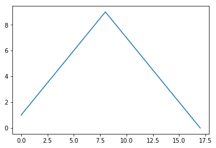


```python
t = np.arange(0, 12, 0.01) # 0부터 12까지 0.01 간격으로 데이터 생성
y = np.sin(t) # 사인 함수에 입력
```


```python
plt.figure(figsize=(10, 6))
plt.plot(t, y)
plt.show()
```


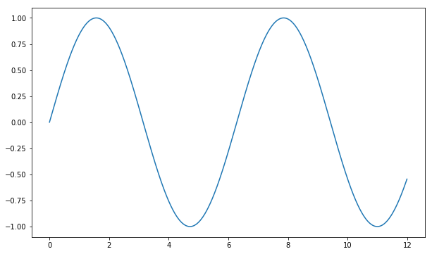


```python
plt.figure(figsize=(10, 6))
plt.plot(t, y)
plt.grid() # 그리드 적용
plt.xlabel('time') # x축 라벨 적용
plt.ylabel('Amplitude') # y축 라벨 적용
plt.title('Example of sinewave') # 제목 적용  
plt.show()
```


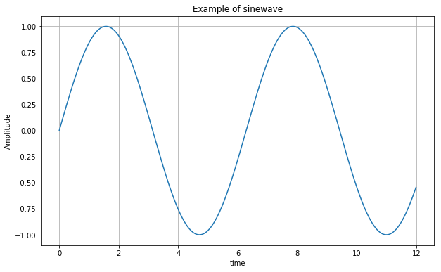


```python
plt.figure(figsize=(10, 6))
plt.plot(t, np.sin(t))
plt.plot(t, np.cos(t))
plt.grid()
plt.xlabel('time')
plt.ylabel('Amplitude')
plt.title('Example of sinewave')
plt.show()
```


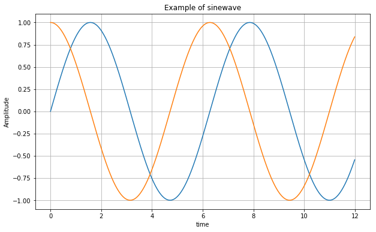


```python
plt.figure(figsize=(10, 6))
plt.plot(t, np.sin(t), label='sin')
plt.plot(t, np.cos(t), label='cos')
plt.grid()
plt.legend() # 범례 추가
plt.xlabel('time')
plt.ylabel('Amplitude')
plt.title('Example of sinewave')
plt.show()
```


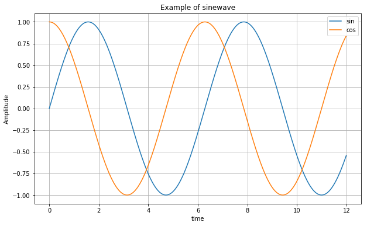


```python
plt.figure(figsize=(10, 6))
plt.plot(t, np.sin(t), lw=3, label='sin')
plt.plot(t, np.cos(t), 'r', label='cos')
plt.grid()
plt.legend()
plt.xlabel('time')
plt.ylabel('Amplitude')
plt.title('Example of sinewave')
plt.show()
```


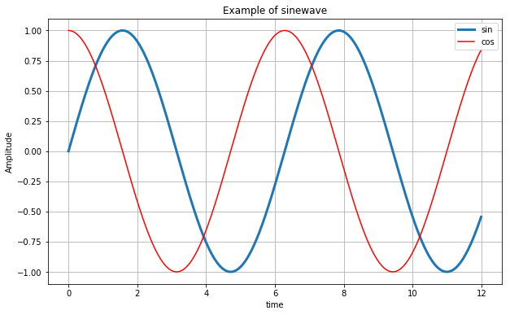


```python
plt.figure(figsize=(10, 6))
plt.plot(t, np.sin(t), lw=3, label='sin')
plt.plot(t, np.cos(t), 'r', label='cos')
plt.grid()
plt.legend()
plt.xlabel('time')
plt.ylabel('Amplitude')
plt.title('Example of sinewave')
plt.ylim(-1.2, 1.2) # y축 제한 설정
plt.xlim(0, np.pi) # x축 제한 설정
plt.show()
```


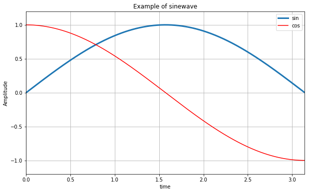


```python
t = np.arange(0, 5, 0.5) # 0부터 5까지 0.5 간격

plt.figure(figsize=(10, 6))
plt.plot(t, t, 'r--')
plt.plot(t, t**2, 'bs')
plt.plot(t, t**3, 'g^')
plt.show()
```


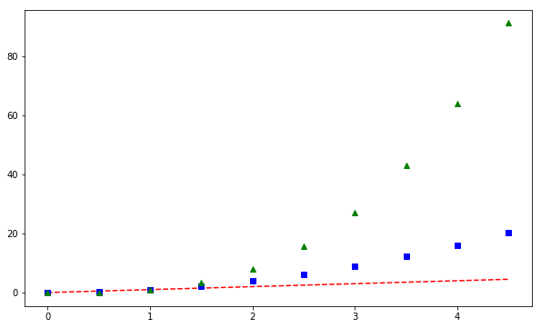


```python
plt.figure(figsize=(10, 6))
pl1 = plt.plot(t, t**2, 'bs')

plt.figure(figsize=(10, 6))
pl2 = plt.plot(t, t**3, 'g^')

plt.show()
```


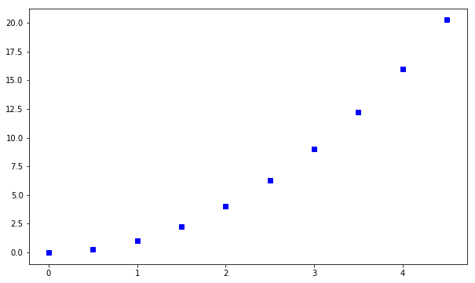


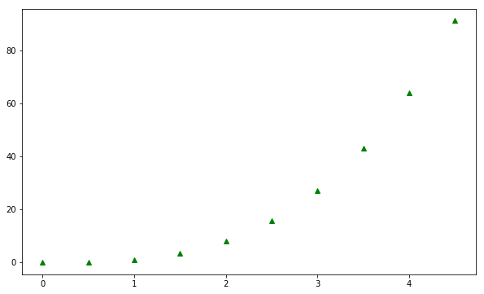


```python
t = [0, 1, 2, 3, 4, 5, 6]
y = [1, 4, 5, 8, 9, 5, 3]

plt.figure(figsize=(10, 6))
plt.plot(t, y, color='orange')
plt.show()
```


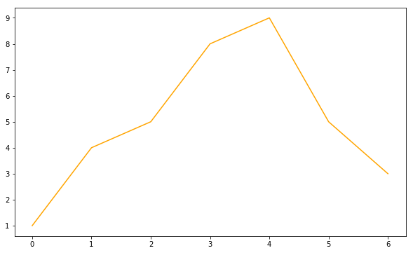


```python
plt.figure(figsize=(10, 6))
plt.plot(t, y, color='pink', linestyle='dashed')
plt.show()
```


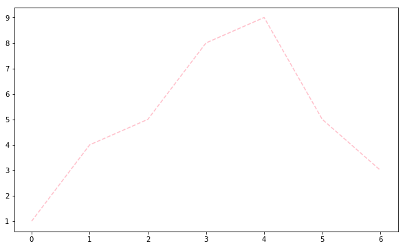


```python
plt.figure(figsize=(10, 6))
plt.plot(t, y, color='skyblue', linestyle='dashed', marker='o')
plt.show()
```


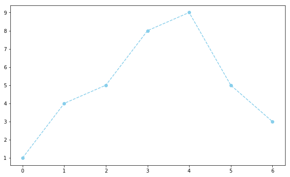


```python
plt.figure(figsize=(10, 6))
plt.plot(t, y, color='gray', linestyle='dashed', marker='o',
        markerfacecolor='red', markersize=10)

plt.xlim([-0.5, 6.5])
plt.ylim([0.5, 9.5])
plt.show()
```


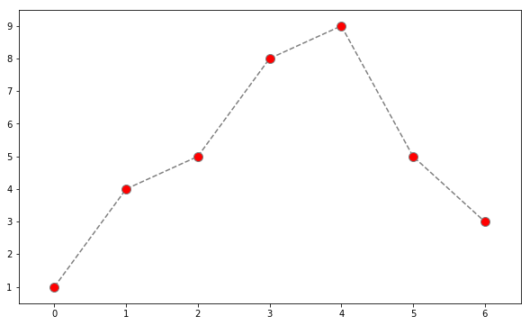


```python
t = np.array([0, 1, 2, 3, 4, 5, 6, 7, 8, 9])
y = np.array([9, 8, 7, 9, 8, 3, 2, 4, 3, 4])
```


```python
plt.figure(figsize=(10, 6))
plt.scatter(t, y)
plt.show()
```


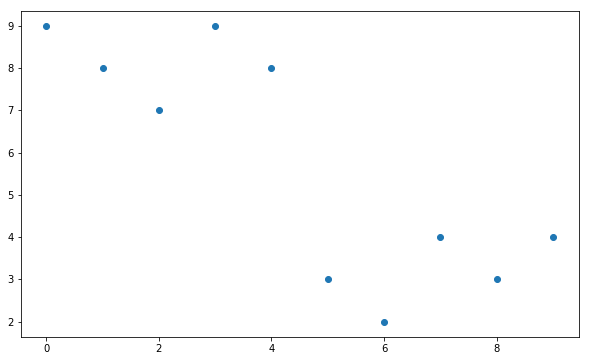


```python
plt.figure(figsize=(10, 6))
plt.scatter(t, y, marker='>')
plt.show()
```


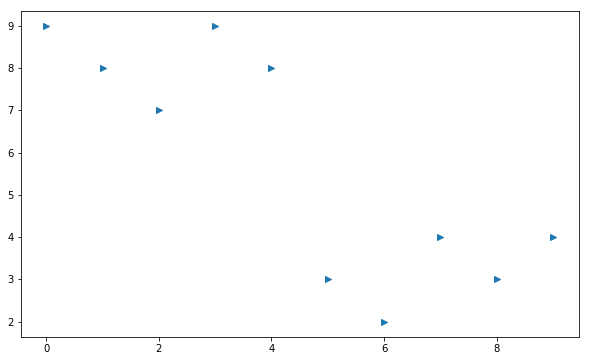


```python
colormap = t

plt.figure(figsize=(10, 6))
plt.scatter(t, y, s = 40, c = colormap, marker='<') # x축 값에 따라 색상 바꿈
plt.colorbar()
plt.show()
```


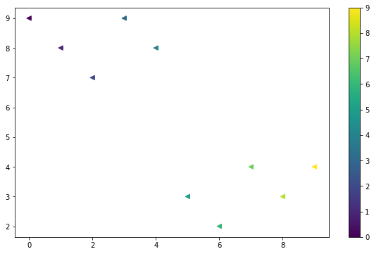


```python
s1 = np.random.normal(loc=0, scale=1, size=1000) # loc: 평균값 지정
s2 = np.random.normal(loc=5, scale=0.5, size=1000) # scale: 표준편차 지정
s3 = np.random.normal(loc=10, scale=2, size=1000)
```


```python
plt.figure(figsize=(10, 6))
plt.plot(s1, label='s1')
plt.plot(s2, label='s2')
plt.plot(s3, label='s3')
plt.legend()
plt.show()
```


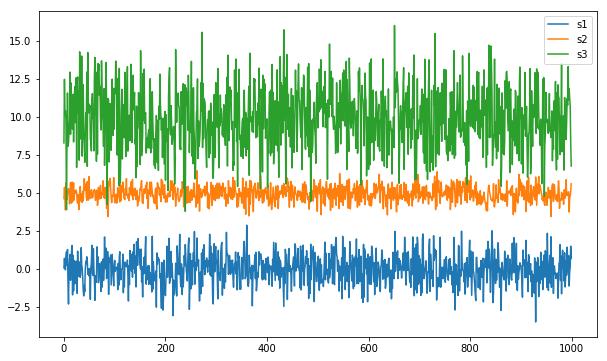


```python
plt.figure(figsize=(10, 6))
plt.boxplot((s1, s2, s3))
plt.grid()
plt.show()
```


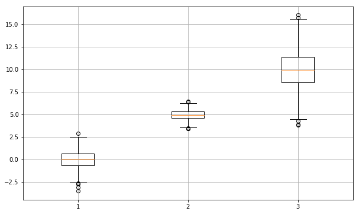


```python
plt.figure(figsize=(10, 6))

plt.subplot(221) # 2행 2열의 1번째
plt.subplot(222) # 2행 2열의 2번째
plt.subplot(212) # 2행 1열의 2번째

plt.show()
```


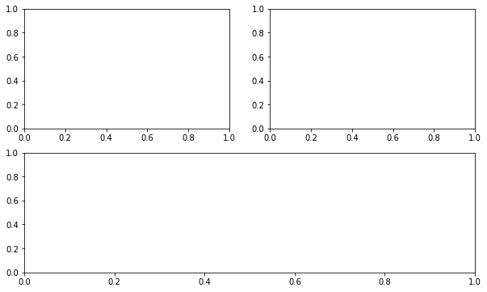


```python
plt.figure(figsize=(10, 6))

plt.subplot(411)
plt.subplot(423)
plt.subplot(424)
plt.subplot(413)
plt.subplot(414)

plt.show()
```


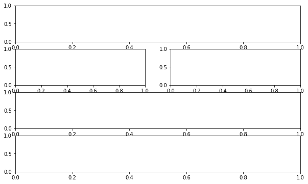


```python
t = np.arange(0, 5, 0.01)

plt.figure(figsize=(10, 12))

plt.subplot(411)
plt.plot(t, np.sqrt(t)) # 제곱근(루트) 계산
plt.grid()

plt.subplot(423)
plt.plot(t, t**2)
plt.grid()

plt.subplot(424)
plt.plot(t, t**3)
plt.grid()

plt.subplot(413)
plt.plot(t, np.sin(t))
plt.grid()

plt.subplot(414)
plt.plot(t, np.cos(t))
plt.grid()

plt.show()
```


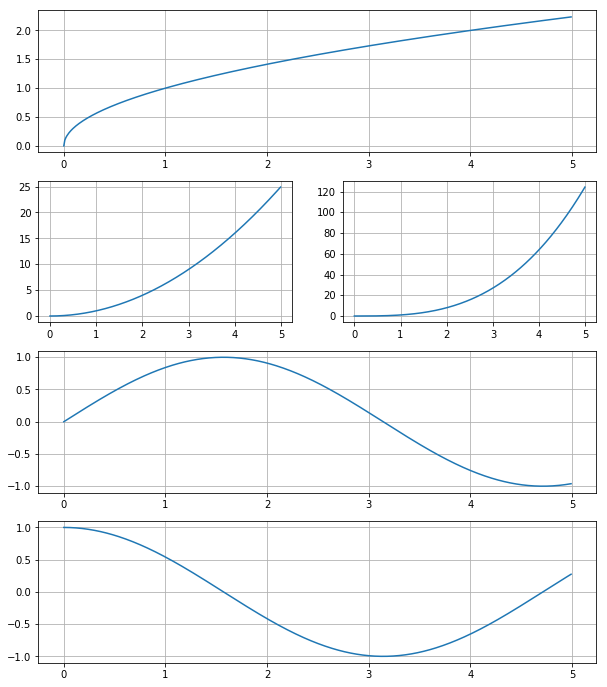

